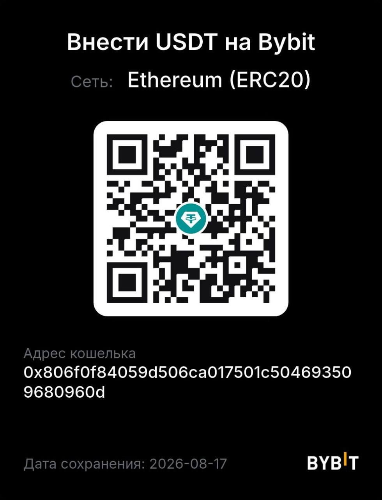

# EvoHime

### Ева — AI-помощница для работы с проектами

EvoHime — локальное Windows-приложение, в котором Ева помогает разбираться в проектах, находить решения и доводить задачи до результата.

Это не просто чат. Ева видит контекст рабочего пространства, умеет работать с файлами и инструментами, показывает ход выполнения задачи и запрашивает подтверждение перед важными действиями.

## Что умеет Ева

- отвечать на вопросы по проекту и его файлам;
- анализировать код, документы и структуру рабочего пространства;
- находить и исправлять проблемы;
- выполнять последовательность действий по одной задаче;
- работать с Git и другими инструментами проекта;
- собирать коллективное ревью Markdown-плана несколькими моделями сразу и сводить их ответы в один итог;
- объяснять, что было сделано и к какому результату это привело;
- сохранять историю проектов и чатов в одном месте.

## Спокойная работа

Ева показывает происходящее понятной лентой действий, а опасные или изменяющие данные операции проходят через подтверждение. Рабочие данные хранятся локально на компьютере пользователя.

EvoHime создан для тех случаев, когда хочется не просто получить ответ от AI, а поручить ему настоящую работу — с контекстом, инструментами и понятным результатом.

## Текущая версия и установка

Текущая версия Windows-клиента — `0.0.000033`. Оболочка — Electron, а Rust
Core и supervisor работают локально и не являются отдельными пользовательскими
приложениями.

Установщик доступен в единственном постоянном релизе [`installer`](https://github.com/rkfsociety/EvoHime/releases/latest/download/EvoHime-Setup.exe).
Поддерживаются Windows 10 2004+ и Windows 11 на x64. После первой установки
клиент сам проверяет ветку `main`, выбирает последний зелёный коммит и при
необходимости пересобирает себя локально; новые versioned releases для этого
цикла не создаются.

## 💛 Пожертвования

Если вы хотите поддержать развитие EvoHime, можно отправить:

- 💰 **Актив:** USDT
- 🌐 **Сеть:** Ethereum (ERC20)
- 📮 **Адрес кошелька:**

`0x806f0f84059d506ca017501c504693509680960d`

⚠️ Пожалуйста, убедитесь, что выбрана именно сеть Ethereum (ERC20).

📱 **QR-код для пожертвования:**

