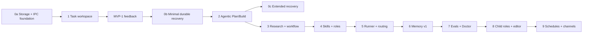

# Единый план развития EvoHime

Дата сводки: 2026-08-11
Статус: консолидированный план следующей native-фазы
Область: Rust Core, SQLite, versioned named-pipe IPC, WinUI 3, supervisor

## 1. Назначение и результат

Этот документ объединяет 11 планов из `docs/plans` в один исполняемый roadmap. Цель — превратить EvoHime из native-чата с инструментами в локального диспетчера долгих, проверяемых и возобновляемых задач разработки и личных операций.

Итоговый пользовательский поток:

1. Пользователь формулирует цель или импортирует PRD/Markdown.
2. Core строит план и граф задач с зависимостями, оценками и критериями готовности.
3. Пользователь видит выбранные роль, skill, модельный маршрут, permissions и бюджет.
4. Core выполняет одну bounded-итерацию, сохраняет checkpoint и evidence.
5. Research, память, skills, tools и fallback подключаются только по policy.
6. На approval, failure, scope drift или превышении бюджета выполнение останавливается.
7. После перезапуска Core состояние восстанавливается через SQLite и IPC replay.

Границы поставки разделены явно:

- **MVP-1 / Feedback build** — этапы 0a + 1: пустой локальный task workspace, ручное редактирование task graph и truthful native UI. Автоматический runner и полноценный recovery не блокируют первый feedback.
- **MVP-2 / Agentic build** — минимальный этап 0b + read-only Plan и ограниченный Build из этапа 2. Unknown effects блокируются или требуют approval; расширенный replay/effects recovery остаётся этапом 0c.

Этапы 3–9 относятся к последующим релизам; research, полная memory, child roles, schedules и внешние каналы не блокируют MVP-1.

## 2. Границы, которые не меняются

- `EvoHime.exe` — WinUI 3/C# thin client; он отображает reducer-состояние и отправляет IPC-команды.
- `evohime-core.exe` — единственный владелец workspace, tools, permissions, approvals, orchestration, model routing, memory и SQLite.
- `evohime-supervisor.exe` — mutex, Job Object, lifecycle, restart/recovery, cleanup дочерних процессов и диагностика.
- Единственный транспорт — совместимый versioned named pipe `desktop-ipc-v1` с request IDs, sequence replay и bounded frame size.
- Секреты хранятся в Windows Credential Manager/DPAPI и не попадают в prompt, trace, package metadata или обычные логи.
- Web UI/Vite, прямой доступ UI к workspace/SQLite, перенос Python/Node runtime и произвольный внешний код не являются частью продукта.
- Автоматический shell, Git commit/push, сеть, установка расширений и внешние коннекторы всегда ограничены policy, budget, approval и audit.
- Product architecture не зависит от веток и PR. Правила разработки EvoHime (текущая `main`, task-only commit и push только по прямому запросу) описаны в quality gate и не являются runtime-инвариантами.

## 3. Что объединено

| Группа исходных планов | Сохранённые идеи |
| --- | --- |
| Task Master; Task Master + OpenJarvis | PRD → задачи, статусы, подзадачи, зависимости, `next_ready`, complexity analysis, research с citations, checkpoints, task workspace, exports, local-first routing, monitors |
| Mem0; Mem0 + LangGraph | append-only provenance, derived current view, области памяти, retrieval, temporal/entity signals, durable graph state, checkpoint/replay, связь памяти и графа без скрытой магии |
| Dify; LangChain | typed context, structured output, workflow graph, provider/model profiles, RAG, extension SDK, middleware, callbacks/traces, evaluation и native editor |
| OpenCode | явное разделение Plan/Build, управляемый context, постоянные сессии, diff/snapshots/rollback, subtask и compacting |
| OpenHands; Agent Reach | capability registry, backend fallback, Core Doctor, research pipeline, безопасный installer, scheduler/triggers, ACP bridge, operational profiles |
| Agency Agents; Agency Agents + skills | versioned Role/Skill contracts, lifecycle DEFINE → PLAN → BUILD → VERIFY → REVIEW → SHIP, deterministic discovery, handoff, deliverables, evals/hooks, read-only child roles, signed packs |

Дублирующиеся предложения не реализуются несколько раз: task graph, durable run state, skill registry, research, routing, memory и observability имеют по одному доменному контракту.

## 4. Целевая доменная модель

### 4.1. Задачи и граф

В SQLite добавить транзакционные сущности `projects`, `work_items`, `work_item_edges`, `work_item_events`, `work_item_tags`, `work_item_research`, `runs`, `run_checkpoints`, `evidence` и bounded command deduplication.

`work_item` хранит parent, title, description, immutable source/PRD reference, priority, estimate, complexity, acceptance criteria, explicit non-goals, tag/workstream, status, `version`, attempt count и последний error. Статусы: `backlog`, `ready`, `in_progress`, `blocked`, `waiting_approval`, `done`, `cancelled`, `failed`.

`work_items.parent_id` означает только decomposition hierarchy. Dependency graph использует `work_item_edges.from_work_item_id`, `to_work_item_id`, `kind`; направление `from → to` означает «from зависит от to». Граф атомарно проверяет отсутствующие ссылки и циклы, а изменения сериализуются через Core command queue. Read-only запросы могут выполняться параллельно с write queue, но получают согласованный snapshot.

Параллельные изменения используют optimistic locking по `version`. Конфликт возвращает UI `expected_version`, `current_version`, last event и diff; UI предлагает `reload and retry` или ручной merge. Force overwrite не является default и требует отдельного подтверждения/audit.

`next_ready` детерминирован: готовой считается только задача, у которой все dependency edges указывают на `done`; `backlog`, `ready`, `in_progress`, `blocked`, `waiting_approval`, `failed` и `cancelled` зависимости блокируют выбор. Затем применяются `priority DESC`, `created_at ASC`, `work_item_id ASC`; сохраняется `selection_reason`. Эти правила общие для UI, runner и replay.

Минимальный storage-контракт:

```sql
work_items(id, project_id, parent_id, title, description, source_ref,
           acceptance_criteria, non_goals, status, priority, estimate,
           complexity, attempt_count, version, created_at)
work_item_edges(from_work_item_id, to_work_item_id, kind,
                PRIMARY KEY(from_work_item_id, to_work_item_id, kind))
run_checkpoints(run_id, checkpoint_id, stage, node_id, attempt, input_hash,
                 state_json, pending_effects_json, committed_at)
```

Все persistent domain IDs — UUIDv7, генерируются только Core и immutable. Import не принимает внешний ID как authoritative; внешние идентификаторы хранятся в `source_ref`. Export сохраняет IDs, а collision при import разрешается новым Core ID с mapping.

Все переходы статуса сохраняют append-only events и являются идемпотентными.

### 4.2. Запуск и workflow

Каждый run имеет immutable canonical snapshots (`policy_snapshot`, `role_snapshot`, `skill_snapshot`, `model_route_snapshot`), `task_id`, `run_id`, checkpoint, budget, tool calls, diff, evidence, approval state и stop reason. Каждый snapshot содержит canonical serialized effective representation, `schema_version` и hash; одного ID текущей конфигурации недостаточно для forensic replay. Состояния разделены:

```text
RunStatus: queued | running | paused | waiting_approval | completed | failed | cancelled
LifecycleStage: define/spec | plan | build | verify | review | ship
StopReason: failure | scope_drift | unexpected_diff | approval_required |
             budget_exhausted | timeout | cancellation | ambiguous_acceptance |
             dependency_blocked | recovery_unknown_effect
ApprovalState: none | pending | approved | rejected | expired
```

`RunEffect` отделяет внешние side effects от SQLite-транзакций. В MVP используется минимальная модель:

```text
run_effect { effect_id, run_id, node_id, kind, idempotency_key,
             immutable_intent_hash, state, started_at, completed_at,
             result_hash }
state: prepared → executing → completed(success | failure)
```

После crash outcome started effect может стать `unknown`; в MVP-2 он сразу переводит run в `BLOCKED` или `WAITING_APPROVAL`, без blind retry. Полный type-specific reconciliation, verifier и `reconciliation_state` относятся к 0c. Checkpoint durable только после commit SQLite transaction.

Recovery и resume разделены: `RECOVERING → RECONCILING → RESUMABLE | BLOCKED | WAITING_APPROVAL | FAILED`; только `RESUMABLE → RUNNING`. Runner lease (`lease_id`, `lease_expires_at`, `heartbeat_at`, `generation`) и extended replay относятся к 0c.

Workflow graph поддерживает typed inputs/outputs, условия, retries, timeout, cancellation, human approval, subgraph и bounded loop. Автоматический loop выполняет только одну ограниченную итерацию за раз и останавливается при failure, scope change, неожиданном diff, неоднозначном acceptance criteria или budget limit.

Task graph и workflow graph — разные сущности. Task graph выбирает work item; workflow graph описывает typed execution nodes для одного run/work item. Node может ссылаться на `work_item_id`, но не владеет decomposition edges; work item может иметь один versioned workflow definition. Для MVP workflow graph не нужен: он статический и вводится в этапе 3, а изменение зафиксированного graph требует cancel/pause, новой graph version и нового run.

`run_policy` задаёт численные `max_iterations`, wall-clock timeout, token budget, tool-call budget и bounded output. В MVP-2 лимиты щадящие и явно отображаются; строгие budgets включаются после проверки корректности.

`ApprovalRequest` разрешает immutable intent, а не абстрактное действие:

```text
approval { approval_id, run_id, effect_id, requested_action, risk_class,
           scope, reason, preview, intent_hash, created_at, expires_at,
           decision, decided_at, decided_by }
```

`Evidence` является структурированной сущностью: `evidence_id`, `run_id`, `work_item_id`, `kind`, `source`, `producer`, `command`, `exit_code`, `artifact_hash`, `input_hash`, `baseline_hash`, `verification_status`, `verifier`, `summary`, `captured_at`. Evidence бывает `claimed` или `verified`; сообщение модели «tests passed» не считается verified без фактического command/exit code. Допустимые виды: `test_result`, `diff`, `build`, `lint`, `screenshot`, `citation`, `manual_review`.

IPC mutating commands используют durable bounded deduplication: `(request_id, client/session identity) → command_hash → committed_result`. Повтор того же запроса возвращает тот же результат; тот же `request_id` с другим payload — protocol error. MVP IPC surface: `CreateTask`, `UpdateTask`, `AddEdge`, `RemoveEdge`, `GetGraph`, `StartRun`, `StopRun`, `ResumeRun` и соответствующие events/acks.

### 4.3. Роли и skills

```text
SkillDefinition {
  id, version, title, description, triggers, lifecycle_stage,
  required_context, references, allowed_tools, risk_class,
  approval_policy, steps, deliverables, acceptance_criteria,
  eval_suite, hooks, author, source, integrity
}

RoleDefinition {
  id, division, identity, mission, communication_style,
  skill_ids, default_model_route, read_only, delegation_policy
}
```

Run сохраняет `RoleRef`, `SkillRef`, их version/hash и effective permissions snapshot. Минимальные refs и policy snapshot вводятся уже в этапе 0a; полный registry — в этапе 4. Skill может только сузить permissions, но не расширить их. Resolution order детерминирован: explicit user selection → exact project rule → lifecycle match → intent/files/language match → stable `id` tie-break; кандидат, нарушающий policy, исключается до выбора.

Начальный native-каталог: onboarding, product spec, planner, native Windows engineer, Rust test engineer, WinUI UX reviewer, code reviewer, security/privacy auditor, release/packaging engineer и minimal-change engineer. Personality влияет только на объяснение результата; тест фиксирует, что она не влияет на `allowed_tools` и `approval_policy`.

### 4.4. Память и research

Память разделяется на profile/preferences, project facts, decisions, task history и ephemeral run context с TTL. Уже в этапе 0a хранится общий append-only provenance для tool call, diff, approval, research и decision; этап 6 добавляет extraction, retrieval и memory UX. Memory v1 ограничивается derived facts без confidence, lexical search и ссылками на primary event; entity/temporal signals, vector search, compression и сложный ranking относятся к memory v2.

Research сохраняет source kind, URL/path, title, fetched-at, hash, redacted excerpt ограниченного размера, citations, freshness/TTL и связь с work item. Раздельно учитываются web, локальные документы и workspace. Research не имеет отдельного privileged network path: fetch/search проходят через общий capability/policy/effect layer с allowlist, audit, cancellation и budget. Непроверенный текст не становится trusted prompt-контекстом без разрешения policy; conflict между memory и research решается по source priority и freshness, результат фиксируется в provenance.

### 4.5. Capability и provider

Capability registry описывает tools, skills, MCP, модели, каналы, triggers и external agents через manifest с checksum/source/version, permissions, allowed domains и input/output schema. Policy snapshot хранит canonical effective policy, `policy_version`, `schema_version`, `effective_permissions_hash` и выбранные ограничения. Provider profiles: `local-first`, `balanced`, `cloud-research`, `offline`; run также сохраняет `requested_route`, `resolved_provider`, `resolved_model`, `route_policy_version` и `fallback_chain`. Для каждого запроса учитываются capability, context size, privacy class, latency/price budget и доступность.

## 5. Единый порядок поставки

### Этап 0a — минимальные storage и restart foundation (P0)

Статус реализации на 2026-08-11: **в работе**. Выполнено в текущем срезе:

- [x] Schema v2 с `projects`, `work_items`, dependency edges, `provenance`, `runs` и bounded `command_dedup`.
- [x] SQLite WAL, backup перед миграцией, идемпотентная миграция и optimistic `version` для изменения статуса work item.
- [x] Базовый CRUD project/work item, self-dependency guard, append-only event replay API и deduplication по `(client_id, request_id)`.
- [x] Additive IPC contract fields for `client_id`, `core_instance_id`, `session_epoch`, `event_sequence` and capability list without removing old fields.
- [x] Core IPC handlers for `CreateProject`, `CreateTask`, `UpdateTaskStatus` and `AddTaskEdge` with durable request deduplication and replayed acknowledgements.
- [x] Targeted Rust tests: 18 Core, 7 IPC и 6 local-storage тестов; UI tests 20/20.

Остаётся для полного закрытия 0a: перенос task CRUD из прямого IPC handler в единый Core command queue, runtime session metadata, rollback при искусственном сбое миграции, unknown-field/enum compatibility fixtures, reconnect/malformed-command tests и durable immutable role/skill/policy/model snapshots.

Зависимости: существующие IPC/SQLite foundations.

- Создать транзакционные миграции для projects, task graph, basic CRUD/events, lightweight run record и provenance; статусы 0a ограничить `backlog`, `ready`, `in_progress`, `done`.
- Ввести минимальные `RoleRef`, `SkillRef`, `PolicySnapshot`, `ModelRouteSnapshot` и immutable source references.
- Зафиксировать SQLite WAL, transaction boundaries, optimistic version и единый Core command queue.
- Определить protobuf envelope с `request_id`, client/session identity, `core_instance_id`, `session_epoch`, `event_sequence`, `capabilities` и bounded frame; oversized payload отклоняется с диагностикой, chunking откладывается.
- Добавить backup перед миграцией, rollback и unknown-field fixtures: reader tolerates unknown fields, новые enum values имеют `UNKNOWN`, breaking semantics получают новую message/command version.
- Для миграций сохранить forward-compatible правило: новые nullable/defaulted поля не ломают старый Core, destructive schema changes идут отдельной миграцией с compatibility window и backup.

Пример IPC surface:

```protobuf
message TaskCrudRequest { string request_id = 1; string project_id = 2; string expected_version = 3; }
message CheckpointResume { string run_id = 1; string checkpoint_id = 2; string policy_snapshot_id = 3; }
```

Выход: после обычного restart сохраняются task graph, events, immutable snapshots и базовый run record. Это минимальный фундамент MVP-1, не recovery platform.

Проверки: Rust migration/transaction tests, rollback при сбое миграции, WAL recovery, optimistic conflict, command deduplication, unknown fields, basic IPC reconnect, malformed requests, `cargo fmt --all -- --check`.

Exit criteria 0a: повторный запуск миграций идемпотентен; rollback возвращает backup при искусственном сбое; CRUD и reconnect проходят на чистой и существующей БД; повторный `request_id` возвращает прежний результат, другой payload даёт protocol error.

### Этап 0b — минимальный durable recovery (P0, MVP-2)

- Добавить durable checkpoints, минимальный `RunEffect`, idempotency keys, cancellation token, timeout и bounded output.
- После kill/restart восстанавливать graph, status и последний durable checkpoint; started effect с неизвестным outcome сразу переводить в `BLOCKED` или `WAITING_APPROVAL`, без blind retry.
- Реализовать базовый supervisor health-ping и Job Object cleanup для MVP-2; сложные generation/lease и full replay остаются 0c.

Выход: после kill/restart Core восстанавливает graph, status и последний durable checkpoint; unknown effects не запускаются повторно и видимы пользователю как blocked/approval.

Проверки: kill-9 в каждой точке checkpoint/effect protocol, unknown → blocked/approval, cancellation, rollback, supervisor cleanup и C# compatibility smoke.

Exit criteria 0b: kill-9 не создаёт второй effect; checkpoint восстанавливается ≤ 5 s на reference workstation; unknown effect не возобновляется автоматически; UI показывает `RECOVERING`, затем `BLOCKED`/`WAITING_APPROVAL`.

### Этап 0c — расширенный replay, protocol и effect recovery (P0/P1)

- Добавить negotiated `protocol_version + capabilities`, backward compatibility matrix и bounded durable command/event replay.
- Реализовать `RECOVERING → RECONCILING → RESUMABLE | BLOCKED | WAITING_APPROVAL | FAILED`, leases/generation, partial-gap replay/resync/full snapshot и type-specific effect verifiers.
- Логировать reconciliation в audit: effect id, globally unique idempotency key, verifier, evidence и решение.
- Провести отдельный protocol design review и kill-9 model tests до production implementation.

Exit criteria 0c: partial gap корректно восстанавливается или приводит к full snapshot; старый клиент проходит compatibility fixtures; ни один verifier не делает blind retry.

### Этап 1 — Plan/Task Core и task workspace (P0)

- Добавить безопасный импорт PRD/Markdown с сохранением исходного текста, версии и происхождения каждой задачи.
- Реализовать ручное создание, decomposition, complexity analysis, dependency graph и `next_ready`.
- В WinUI показать Projects/Tasks: ready, blocked, done, граф, карточку, подзадачи, acceptance criteria и event history.
- Добавить действия Следующая задача, Разблокировать, Отложить, Запустить, Остановить, Повторить и Отметить готовой; Core подтверждает каждый переход.
- Не менять файлы только из-за импорта PRD.

Проверки: parser diagnostics, malformed PRD, duplicate import, cycle/missing dependency, concurrent update, deterministic `next_ready`, UI IPC smoke и truthful blocked/ready states.

MVP-1 milestone после этапа 1: пользователь видит пустой task workspace, вручную создаёт/импортирует задачи, редактирует decomposition/dependencies, выбирает `next_ready` и запускает ручное действие без автоматического runner. Feedback собирается через UI useful/not useful, локальные logs и короткий task-flow опрос; успех — graph edit/reconnect без необъяснимых blocked states.

### Этап 2 — Plan/Build lifecycle, context и snapshots (P0)

- В MVP-2 оставить read-only `/plan` и `/spec`, Build только по ограниченному списку разрешённых текстовых файлов и один approval на весь bounded Build; полный lifecycle mutation matrix, compaction и сложный rollback расширяются после feedback.
- Добавить context assembler из task, acceptance criteria, non-goals, локальных workspace references и ручных подсказок пользователя. Research stub пустой, но Plan/Build полностью offline и не зависит от research.
- Snapshot минимален и связан с run: `snapshot { id, run_id, workspace_hash, diff[], created_at }`; snapshot+diff атомарны. Он не включает SQLite и не откатывает external effects. UI явно показывает эту границу.
- Для workspace использовать manifest + content hashes; ограничить snapshot размером и текстовыми файлами MVP. Запись требует `expected_content_hash`; mismatch даёт workspace conflict, а не overwrite. Git diff/rollback — отдельный ограниченный Core tool, auto-commit/push не входят.
- Полный machine-readable scope включает `allowed_paths`, `allowed_operations`, `expected_outputs`, `protected_paths`, `max_files_changed`, `max_bytes_changed`, `allow_create`, `allow_delete`, `allow_rename`, `allowed_file_types`, `baseline_snapshot_id`, `acceptance_criteria`.
- Approval UI показывает diff, files, path/risk/budget/timeout и immutable `intent_hash = hash(command + diff + scope + risk_class + effective_permissions_hash)`. Batch approval разрешает однотипные операции в bounded scope; force mode требует explicit confirmation и audit.
- Добавить UI policy panel для allowed paths, budgets и timeout; конфигурация сохраняется Core, а не WinUI.

Проверки: plan не пишет, build не выходит за scope, offline Plan/Build, expected hash conflict, prompt/context budget ограничен, redaction/order deterministic, snapshot rollback восстанавливает только workspace, reconnect не теряет lifecycle, approval hash mismatch блокирует выполнение.

### Этап 3 — Research и typed workflow graph (P0)

- Реализовать сначала статический workflow graph с typed input/output, condition, retry, timeout, cancellation, approval и subgraph. Dynamic graph edits отложить.
- Реализовать research pipeline: запрос → разрешённый HTTP/search → извлечение → краткое резюме → citations → сохранение.
- Evidence хранит redacted/plain excerpt с max bytes, fetched-at, TTL/freshness, source hash и approval/provenance link.
- Ограничить domains, время, размер ответа и стоимость; добавить refresh и cancel через общий network capability layer.
- Для security, dependency и API-вопросов поддержать policy, требующую research перед запуском.

Пример node schema:

```yaml
id: inspect-build
inputs: { workspace: path }
outputs: { evidence: evidence[] }
retry: { max_attempts: 2, backoff: exponential }
approval: none
```

Проверки: citation/source integrity, stale results, prompt-injection fixtures, network deny, retry/backoff, partial failure, offline stub и deterministic workflow replay.

### Этап 4 — Skills, roles и capability registry (P0/P1)

- Для MVP достаточно `RoleRef`, `SkillRef`, `allowed_tools` и `risk_class`; полный registry/parser/validator и deterministic matcher по intent, файлам, языкам, lifecycle stage и project rules реализовать здесь.
- UI показывает выбранные role/skill, version, причины, risk, tools и acceptance criteria; пользователь может закрепить или заменить выбор.
- Ввести lifecycle snapshot: активная definition immutable в рамках run; skill не расширяет permissions и не меняет context order.
- Поддержать skill/capability manifest, effective permissions, allowed domains и разделение инструкций, MCP и исполняемых расширений.
- Установка — только локальный архив или HTTPS с manifest, hash/signature и совместимостью; install scripts запрещены по умолчанию; update staged, rollback сохраняется.

Проверки: invalid risk/tool, missing reference, version conflict, hash/signature mismatch, path escape, prompt injection, unknown skill и disable/rollback.

### Этап 5 — Безопасный task loop и model routing (P1)

- Runner: выбрать `next_ready`, собрать task/research/skill context, выполнить bounded run, записать checkpoint и предложить следующий шаг.
- `run_policy`: max iterations, wall-clock timeout, tool-call/token budget, network policy, approval mode и stop conditions. Значения defaults и способы override хранятся в `settings.toml`-подобной конфигурации и видны в UI.
- Автоматически остановиться на approval, failure, unexpected diff, budget, scope drift или неясном критерии.
- Добавить local-first/balanced/cloud-research/offline routing и явный visible fallback.
- Логировать redacted provider/model, latency, tokens, retries, estimated cost и причину маршрутизации.

Проверки: offline execution, provider unavailable, fallback policy, token/tool budgets, stop/resume/pause, supervisor Job Object cleanup и отсутствие silent cloud route.

### Этап 6 — Memory v1 и RAG для локального workspace (P1)

- Добавить memory domain/API: create, list, search, update, archive, forget и provenance inspection.
- Интегрировать extraction фактов и решений после run только по policy; пользователь подтверждает важные записи.
- В Memory v1 реализовать scoped retrieval project/task/workspace, lexical search, derived facts без confidence и ссылки на первичное событие. Vector search, recency ranking, confidence, entity/temporal signals и сложный hybrid search — memory v2.
- Добавить TTL для ephemeral context, privacy labels, export/delete и redaction; export/delete требуют approval и audit. Compression и расширенная retention automation — после измерения роста данных.

Проверки: scope isolation, stale/conflicting facts, delete/forget, migration rollback, no secret leakage, retrieval relevance fixtures и offline operation.

### Этап 7 — Evals, hooks, observability и Core Doctor (P1)

- Evals для skill selection, allowlist, plan quality, IPC compatibility, cancellation, replay, citations, memory retrieval, routing и UI truthfulness.
- Hooks `before_context`, `before_tool`, `after_tool`, `before_commit`, `after_task` только наблюдают или отклоняют по policy, не получают секреты и не могут менять порядок context.
- Локальный JSONL/SQLite audit trail: versions, tool calls, approvals, durations, failures, budgets, diffs и evidence.
- Core Doctor проверяет pipe, storage/migrations, providers, permissions, tools, scheduler и recovery; UI показывает actionable diagnostics.
- Feedback: useful/not useful, correction, rejection reason, successful/failed tool result; хранение и агрегация локальные, feedback не меняет поведение по умолчанию, наружная telemetry только opt-in.

Проверки: bounded trace, redaction, no secret leakage, deterministic eval fixtures, doctor failure simulation и восстановление после повреждённого checkpoint.

### Этап 8 — Child roles, handoff и native workflow editor (P1/P2)

- Разрешить дочерние read-only задачи для onboarding, code search, threat-model review, test-plan review и документации.
- Child получает урезанный context и `child_task_id`, не имеет write, shell, commit, install или network mutation tools.
- Child не может создавать нового child, передавать elevated permissions через handoff или превышать фиксированный `max_output_bytes`.
- Родитель проверяет структурированный report, confidence и sources перед включением в plan/build.
- В WinUI добавить catalog, workflow editor, timeline child tasks/evals/hooks/evidence, approval state и понятные blocked/error states.
- Поддержать handoff contract с inputs, outputs, acceptance criteria, risks и evidence.

Проверки: child write/shell/commit denial, timeout/cancel, bounded output, parent-child visibility, editor round-trip и visual smoke.

### Этап 9 — Schedules, proactive Pulse и внешние каналы (P2)

- Сделать schedule/trigger/monitor state/last checkpoint/next run/retry/backoff/dead-letter entities.
- Зафиксировать dead-letter policy: число попыток, backoff, причину перемещения и ручное requeue; добавить OAuth/browser authorization protocol для внешних каналов, не помещая токены в traces.
- Начать с локальных источников: GitHub notifications, workspace changes, CI status, local files и task deadlines.
- Supervisor запускает monitor с теми же budgets, permissions, approvals и cancellation, что и обычный run.
- Pulse показывает digest, новые события, пропущенные запуски и degradation; failure не скрывается уведомлением.
- После стабилизации локального контура добавить ACP/external-agent gateway и отдельные коннекторы.

Проверки: missed run, duplicate trigger, dead letter, backoff, restart, cancellation, permission denial и отсутствие внешней мутации без approval.

Зависимости этапов:



## 6. Native UI-поставка

Последовательность экранов: reducer/state → shared theme и three-zone frame → Projects/Tasks → task detail/graph → composer Plan/Build → role/skill catalog → research/memory inspector → run timeline/doctor → workflow editor → Pulse/schedules.

MVP UI ограничен Projects/Tasks, task detail/graph и Plan/Build composer. В three-zone frame доступны project/task navigation, центральный graph/detail и правая панель status/actions. Пользователь видит `next_ready`, selection reason, locks, dependencies, role/skill/route/policy snapshot, budget, diff и approval preview. Поздние catalog/inspector/editor не блокируют MVP.

Визуальное направление сохраняется: graphite/dark surfaces, violet/turquoise accents, compact desktop density, оригинальная iconography. UI обязан честно различать Empty, Loading, Ready, Running, Degraded, Error и Blocked, а не показывать обещанные действия как доступные.

WinUI не хранит state, не читает SQLite/workspace, не запускает installer и не принимает решение о permissions. Все данные, команды и ошибки приходят через IPC.

Reducer UI хранит только `last_known_good_snapshot` и последний `event_sequence` для reconnect/resync; это cache представления, а не authoritative state. Для long-running commands Core публикует progress, log summary и heartbeat events, чтобы UI не выглядел зависшим.

Минимальные сообщения ошибок: `Blocked: защищённый path <path> требует permission; выберите scope или отмените run`, `Degraded: Core работает, но provider недоступен; доступен offline fallback`, `Error: checkpoint повреждён; выполнение остановлено, откройте Core Doctor`, `Waiting approval: показан immutable diff и hash intent`. Секреты и токены в сообщениях запрещены.

## 7. Безопасность и отказоустойчивость

- Allowlist и `risk_class` вычисляет Core; prompt, Role и Skill не могут расширить права. Минимальная risk matrix:

| Класс | Примеры | Ограничения |
| --- | --- | --- |
| `read` | чтение workspace, локальный поиск | bounded output, audit, без approval |
| `write` | изменение разрешённых файлов | immutable scope, preview, пакетный approval |
| `memory_write` | сохранение факта/решения | policy, user confirm для важных записей, audit |
| `research_write` | сохранение research/evidence | source hash, redaction, rate limit, audit |
| `dangerous` | shell, install, protected path | explicit approval, timeout, audit, cancellation |
| `external` | network, GitHub, delivery | allowlist, policy, visible intent, approval |

- Каждая опасная операция получает approval, timeout, cancellation, bounded output и redacted audit record.
- Default tool policy: чтение файлов и `git diff/status` — `read`; запись разрешённых текстовых файлов — `write`; memory/research persistence — `memory_write`/`research_write`; shell, install и `git reset/clean` — `dangerous`; HTTP, GitHub, commit/push и delivery — `external`. Все external requests rate-limited и полностью audit-ируются после redaction.
- Path traversal, archive escape, изменённый manifest, неподписанный package и недопустимый domain отклоняются до выполнения.
- Child processes принадлежат supervisor Job Object; restart/recovery не создаёт дублей. При recovery Core атомарно claims lease; конфликт владельцев переводится в blocked/reconciliation, а не запускает второй runner.
- Migration всегда транзакционная и предваряется backup; corrupted state переводит систему в диагностируемый blocked state.
- Research, memory, logs и traces очищают секреты, токены, полный чувствительный context и prompt injection payloads.
- Credential rotation обрабатывается через явное удаление/повторную авторизацию в Credential Manager/DPAPI; старые токены не копируются в traces. Child roles получают отдельный filesystem/network sandbox.
- Retention contract: immutable forever — identity, approval intent hash и provenance links; compactable — event summaries, old traces и derived views; disposable — expired ephemeral context и redacted temporary payloads; referenced objects удаляются только после проверки replay/evidence references. WAL, audit и checkpoints очищаются по retention policy, не нарушая recovery window.
- Graceful shutdown/update — отдельная IPC-команда `shutdown`: Core запрещает новые effects, flush/checkpoint-ит состояние и сообщает Supervisor готовность к завершению; forcible kill проходит через recovery contract.
- Commit/push, публикация и внешние connector actions остаются отдельными явно разрешёнными действиями.

## 8. Общий quality gate каждого этапа

Перед завершением этапа должны пройти свежие проверки затронутых компонентов:

- `cargo fmt --all -- --check`;
- targeted Rust unit/integration/compatibility tests;
- WinUI/C# IPC и UI tests;
- native workflow/package smoke при затрагивании packaging/runtime;
- `git diff --check`;
- проверка запуска staging EXE, IPC reconnect/replay и truthful UI при UI-изменениях;
- очистка ненужных `target/`, `bin/`, `obj/` и временных package artifacts.

Минимальный шаблон тест-кейса:

| Сценарий | Ожидаемый результат | Инструмент проверки |
| --- | --- | --- |
| IPC reconnect | состояние восстановлено, gap обработан | Rust/C# compatibility test |
| Migration rollback | данные сохранены, backup доступен | SQLite transaction test |
| Unknown effect | retry не выполняется без reconciliation | recovery integration test |
| `next_ready` tie-break | UI и Core выбирают одну задачу | deterministic unit test |

Для task graph и `next_ready` добавить benchmark на 500 задач и stress test на 10 000. Для этапов настроить automated regression в CI: Rust tests, .NET tests, IPC fixtures, packaging smoke и security fixtures. Каждый этап оформляется отдельным task-only commit в текущей `main`; это development rule, а не продуктовый контракт. Нельзя считать плановую функцию реализованной до появления теста и evidence в trace.

MVP acceptance tests:

| Сценарий | Core acceptance | UI smoke |
| --- | --- | --- |
| Создание задачи | Core создаёт UUIDv7, version=1, event записан | карточка появляется после event |
| Dependency graph | missing/cycle отклонены атомарно | направление edge и конфликт видимы |
| Reconnect | dedup повторяет committed result | last-known snapshot resync-ится |
| `next_ready` | 500 задач выбираются детерминированно ≤ 100 ms p95 | selection reason отображён |
| MVP feedback | импорт/ручное редактирование сохраняют исходный PRD | Empty/Ready/Blocked truthful |

Benchmark на 10 000 задач остаётся stress test; основная target-метрика — 500 задач, плюс memory usage и throughput. CI включает integration tests Core ↔ Supervisor ↔ IPC/UI smoke, migration rollback, partial failure, zombie process cleanup и kill-9 harness.

К каждому этапу прилагаются краткие обновления glossary/FAQ. Базовый glossary: `bounded loop` — итерация с численными limits и stop reason; `provenance` — append-only связь факта с первичным событием; `capability registry` — policy-описание доступных tools/providers; `checkpoint` — durable committed run state; `reconciliation` — проверка outcome unknown effect без blind retry.

## 9. Risk register и operational policy

| Риск | Вероятность | Влияние | Митигация |
| --- | --- | --- | --- |
| Этап 0 становится бесконечным | высокая | критическое | MVP-1 после 0a+1, timeboxed 0a/0b, перенос расширенного recovery в 0c |
| IPC Rust/C# несовместим | средняя | высокое | mini-spec, negotiated capabilities, fixtures в CI |
| Двойной side effect после crash | средняя | критическое | RunEffect, idempotency key, unknown/reconciliation, approval |
| SQLite растёт без контроля | средняя | среднее | WAL, archive/vacuum, TTL и retention policy |
| WinUI сложнее MVP | средняя | высокое | ограниченный MVP UI, текстовые критерии и visual smoke |
| Offline provider недоступен | средняя | высокое | visible fallback, Core Doctor, no silent cloud route |

Hard deadline: 0a и 0b должны иметь timeboxed implementation window; по истечении deadline незавершённые extended recovery features переносятся в 0c, а MVP-1 не блокируется.

Начальные измеримые targets для MVP: p95 IPC command round-trip ≤ 100 ms без model call; reconnect/resync ≤ 2 s при доступном Core; minimal recovery после supervisor restart ≤ 5 s до truthful state; `next_ready` для 500 задач ≤ 100 ms p95; 10 000 задач — только stress test ≤ 250 ms; SQLite для 10 000 tasks + 1 000 runs — retention target фиксируется benchmark-ом до implementation и не растёт без bounded policy. Targets измеряются benchmark/smoke-тестами и пересматриваются только отдельным решением.

Обновление Core: перед запуском новой версии Supervisor делает backup, Core применяет forward-compatible migrations, показывает preview/progress и при ошибке восстанавливает backup; destructive migration требует отдельного migration wizard. Старый Core остаётся совместимым в пределах compatibility window.

## 10. Что сознательно не переносится

- Полные каталоги внешних personas/divisions, marketing-агенты и personality-driven permissions.
- Чужие Node/Python CLI, обязательные MCP-серверы, installers, shell scripts, UI, названия и точная runtime-структура.
- Произвольный код из Markdown skills, install scripts и capability, обходящие policy.
- Автоматические ветки, бесконечные loops, silent cloud fallback, auto-commit/push и внешний research без approval/audit.
- Graph database как обязательный storage layer; сначала SQLite и provenance.
- Внешние календари и почта до стабилизации локальных schedules/monitor protocol.
- Возврат web UI/Vite или бизнес-логики в WinUI.

## 11. Итоговые критерии готовности инициативы

Инициатива готова, когда одновременно выполнены следующие условия:

1. Из требования получается draft-plan с non-goals, зависимостями, acceptance criteria, complexity и понятным `next_ready`.
2. Plan/Build/Verify/Review/Ship разделены, а каждое автоматическое действие имеет policy, budget, timeout, cancellation и approval.
3. Core переживает restart во время research, tool call, workflow и loop, восстанавливая checkpoint через SQLite и IPC replay.
4. Пользователь видит текущие task, role, skill, model route, permissions, diff, trace, evidence и причину blocked/error.
5. Skills, packages, child roles, research и memory проходят manifest/permission/redaction checks и могут быть отключены или откачены.
6. Local/offline route работает без облака, а fallback видим и разрешён policy.
7. Rust, C#, native package, security, eval, UI smoke и `git diff --check` проходят свежие проверки.
8. Нет скрытого доступа UI к workspace/SQLite, секретов в trace и непреднамеренной внешней мутации.

## 12. Порядок после этой сводки

Сначала реализовать 0a и Этап 1 параллельными потоками backend/UI, затем провести MVP-1 feedback. После этого добавить минимальный 0b и Agentic Plan/Build из этапа 2; расширенный recovery 0c и research/workflow могут разрабатываться параллельно через общий context/IPC contract. Далее последовательно стабилизировать skills, bounded loop/routing, memory, evals, child roles и только после этого — schedules и внешние каналы.
