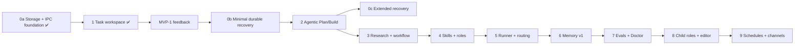

# Единый мастер-план EvoHime

Дата сводки: 2026-08-12
Статус: единственный действующий план развития
Область: `evohime-core`, `evohime-permissions`, `evohime-tool-runtime`, `evohime-model-gateway`, `evohime-local-storage`, `evohime-desktop-ipc`, `evohime-supervisor`, WinUI 3 client

Этот документ заменяет собой четыре ранее отдельных плана:

| Источник | Что перенесено |
| --- | --- |
| `evohime-consolidated-plan.md` | Native roadmap этапов 0a–9, доменная модель, границы, quality gate, risk register |
| `evohime-consolidated-plan-reviews.md` | Шесть раундов внешнего ревью — учтённые правки в тексте, сводка находок в приложении A |
| `evohime-self-healing-self-improvement.md` | Фазы 1–5 самовосстановления агентного цикла (v3.1 после четырёх раундов саморевью) |
| `2026-08-12T1428-permission-policy-rules.md` | Декларативные permission-правила, привязка approval к вызову, окно дедупликации |

Отдельных планов больше нет: все правки вносятся сюда.

---

## 1. Как читать этот план

В работе два трека, и они не конкурируют за одни и те же файлы.

**Трек A — живой агентный цикл.** Ева уже работает: `ToolAgent`, инструменты, permissions, gateway, supervisor. Здесь есть активные дефекты безопасности и надёжности, и их цена — сегодняшняя, а не будущая. Трек A — источник P0.

**Трек B — native roadmap.** Долгая перестройка в локального диспетчера проверяемых задач: task graph, durable recovery, Plan/Build, research, skills, routing, memory, evals, schedules. Этапы 0a–9. Трек B двигается волнами, но не блокирует трек A и не блокируется им, пока соблюдены точки стыковки из раздела 9.

Приоритет между треками: **сначала закрывается активный дефект трека A, затем очередная волна трека B.** Причина простая — дыра в approval и ложное «задача выполнена» вредят каждый день, а недоделанный этап 0c не вредит никому.

---

## 2. Инварианты, которые не меняются

Продуктовые границы:

- `EvoHime.exe` — WinUI 3/C# thin client: отображает reducer-состояние, отправляет IPC-команды, не хранит state, не читает SQLite/workspace, не принимает решений о permissions.
- `evohime-core.exe` — единственный владелец workspace, tools, permissions, approvals, orchestration, model routing, memory и SQLite.
- `evohime-supervisor.exe` — mutex, Job Object, lifecycle, restart/recovery, cleanup дочерних процессов, диагностика.
- Единственный транспорт — versioned named pipe `desktop-ipc-v1` с request IDs, sequence replay и bounded frame size. Смена major-версии контракта — вне объёма этого плана.
- Секреты живут в Windows Credential Manager/DPAPI и не попадают в prompt, trace, память, package metadata и обычные логи.
- Web UI/Vite, прямой доступ UI к workspace/SQLite, перенос Python/Node runtime и произвольный внешний код в продукт не входят.
- Автоматический shell, Git commit/push, сеть, установка расширений и внешние коннекторы всегда ограничены policy, budget, approval и audit.
- Ева не меняет собственный исходный код и промпты без approval.

Инварианты исполнения: sandbox, таймауты, отмена, approval для опасных инструментов, отсутствие секретов в логах и памяти.

Правила разработки (не runtime-контракт): работа в текущей `main`, task-only коммиты, push только по прямому запросу, каждая новая функция и каждое исправление покрываются тестом, перед заявлением о готовности — свежий прогон тестов и `git diff --check`, сравнение путей и команд регистронезависимое с нормализацией разделителя в `/`, существующие сериализованные структуры расширяются полями с `#[serde(default)]`.

---

## 3. Сквозной порядок выполнения

| № | Волна | Содержание | Трек | Почему здесь |
| --- | --- | --- | --- | --- |
| 1 | 0 | Активные дефекты: approval-баг delivery-gate, привязка approval к вызову | A | Обход политики и ложное «сделано» работают прямо сейчас |
| 2 | I | Permission policy rules: glob, набор правил, встраивание в `check_scoped`, subject вызова (shell + git), блок-лист интерпретаторов, загрузка `permissions.json` | A | Даёт политике предмет: `rm *` и `git push*` перестают быть неотличимыми от всего остального |
| 3 | II | Типизированный результат инструмента (фаза 1) | A | Предпосылка для восстановления, метрик и памяти |
| 4 | III | Адресное восстановление и эскалация (фаза 2), включая единую дедупликацию с окном | A | Наибольший эффект на живучесть прогона |
| 5 | IV | Сброс бюджета рестартов supervisor (задача 4.1) | A | Дёшево, ощутимо для аптайма |
| 6 | V | Наблюдаемость и измеримость (фаза 5) | A | Без метрик недоказуемы волны II–IV и нечего писать в память |
| 7 | VI | Память в агентном цикле (фаза 3) | A | Наибольший выигрыш, но зависит от II, III и V |
| 8 | VII | Устойчивость провайдера (задачи 4.2, 4.3) | A | Зависит от поведения провайдера, можно параллельно с VI |
| 9 | — | Native roadmap: 0b/0c → 2 → 3 → 4 → 5 → 6 → 7 → 8 → 9 | B | Двигается своим темпом между волнами трека A |

Жёсткие связки по порядку, не по желанию:

- дефект 0.2 закрывается задачей 6.5, поэтому волна 0 не отделима от волны I технически — отделён только приоритет;
- волна II (7.3) обязана классифицировать оба отказа, введённых в 6.5, иначе они станут третьим тихим путём вместо двух починенных;
- волна III (8.4) правит соседние строки того же `evohime-core/src/lib.rs`, что и 7.3, — параллелить их означает гарантированный конфликт;
- 10.3 зависит и от резолвера 6.4, и от замены `failed` на `outcome.ok` из волны II; до них она нереализуема.

Зависимости трека B:



---

## 4. Общие требования к внедрению трека A

**Kill-switch.** Каждая волна, меняющая поведение живого прогона (II, III, VI и задача 5.3), закрывается env-флагом с безопасным значением по умолчанию на время обкатки. Флаг снимается после подтверждения метриками, а не «на глаз». Снятие флага — обязательный пункт закрытия волны, иначе флаги копятся и превращаются в два несогласованных поведения.

**Shadow-режим перед строгим.** Волна II и задача 5.3 сначала работают параллельно старой эвристике: новая оценка только логируется в trace, решения принимает старая. Строгий режим включается после сверки расхождений на реальных прогонах.

**Размещение кода.** `lib.rs` в `evohime-core` уже за 5 000 строк (5 103 на 2026-08-12). Новая логика идёт в отдельные модули `recovery.rs`, `run_metrics.rs`, `task_memory.rs`, `permission_rules.rs`; в `lib.rs` остаются точки вызова.

**Какой именно агент дорабатывается.** В `lib.rs` живут два независимых агента с одинаково названным методом:

- потоковый чат-агент ([lib.rs:1808](../../crates/evohime-core/src/lib.rs:1808)) — эмитит `CoreEvent::AssistantDelta` ([lib.rs:1829](../../crates/evohime-core/src/lib.rs:1829)), инструментов не вызывает;
- `ToolAgent` ([lib.rs:1907](../../crates/evohime-core/src/lib.rs:1907)) — цикл с инструментами, вызывает `chat_with_tools_for_route` без стриминга.

Волны 0, II, III, V, VI относятся **только к `ToolAgent`**. Потоковый агент не имеет ни recovery-логики, ни delivery-gate; приводить его в порядок — отдельная работа. Волна VII затрагивает общий gateway, поэтому различие между агентами там существенно.

---

## 5. Волна 0 — активные дефекты

### 0.1. Отклонённый approval считается успехом

**Дефект.** Строка `"approval denied"` ([lib.rs:2205](../../crates/evohime-core/src/lib.rs:2205)) не содержит ни одного маркера из текстовой эвристики `tool_output_failed`, поэтому отклонённый хозяином вызов считается успешным и выставляет `mutation_done`. Delivery-gate пропускает задачу без фактической мутации.

**Правка** точечная и не ждёт всей волны II: отказ в approval трактуется как провал вызова. Полная типизация приходит следом.

Критерий: регрессионный тест — отклонённый approval для `filesystem.write` не выставляет `mutation_done`.

### 0.2. Approval — карт-бланш, а не разрешение на вызов

**Дефект.** `execute_after_approval` ([registry.rs:362-382](../../crates/tool-runtime/src/registry.rs:362)) проверяет только, что approval с данным `approval_id` находится в состоянии `Granted`, после чего исполняет **тот `input`, который передан в вызов**, а не тот, что был сохранён в approval. Ни сверки с одобренным вызовом, ни `check_scoped` на этом пути нет. Последствия:

- одобрение, выданное на `cargo test`, годится для исполнения чего угодно, если вызывающий подставит другой `input`;
- правило `Deny`, добавленное между запросом approval и его подтверждением, не сработает.

Без этой правки вся политика волны I обходится штатным потоком «агент попросил → хозяин подтвердил».

**Две отдельные защиты, обе нужны.** Сверка вызова с одобренным закрывает подмену целиком, включая команды, которых нет ни в одном правиле (`cargo test` → `cargo publish`). Повторная проверка `Deny` закрывает изменение политики между запросом и подтверждением, когда сам вызов не менялся. Ни одна не покрывает случай другой.

Технически 0.2 опирается на поля и функции волны I (`ApprovalRequest.command`, `command_from_input`), поэтому реализуется как её завершающая задача — см. 6.5. Здесь она названа как дефект, чтобы приоритет был виден.

---

## 6. Волна I — декларативные permission-правила

**Цель.** Дать EvoHime упорядоченные правила разрешений с glob-паттернами, которые учитывают *содержимое* вызова инструмента (в первую очередь shell-команду), а не только категорию и путь.

**Архитектура.** В `evohime-permissions` добавляется слой `PolicyRule` (permission + glob + режим) с семантикой «побеждает последнее совпавшее правило». Слой встраивается в `check_scoped` с явным приоритетом: жёсткий `Deny` из правил не перекрывается runtime-грантами, остальные режимы стоят ниже path grants и session overrides. `tool-runtime` передаёт в проверку subject вызова — фактическую программу с аргументами для `shell.execute` и синтезированную команду для `git.*`. Правила читаются Core из `permissions.json` в data dir при старте; этот файл — единственный источник истины, второго хранилища для них не заводится.

Источник модели — дизайн permission-системы opencode (`opencode.ai/docs/permissions`). Код оттуда не переносится, только модель правил; перед любым заимствованием текста проверить LICENSE.

Изменения в `crates/desktop-ipc/proto/evohime.desktop.proto` в этой волне **не выполняются**: все новые поля живут внутри существующих JSON-payload'ов либо только в Rust.

| Файл | Ответственность |
| --- | --- |
| `crates/permissions/src/pattern.rs` (создать) | `glob_match(pattern, value)` — чистая функция |
| `crates/permissions/src/policy.rs` (создать) | `PolicyRule`, `PolicyRuleSet`, «последнее совпавшее», дефолтный набор |
| `crates/permissions/src/lib.rs` (изменить) | Хранение правил в движке, встраивание в `check_scoped`, поле `command` в `PermissionCheck` и `ApprovalRequest`, `approval_matches` |
| `crates/tool-runtime/src/registry.rs` (изменить) | Построение subject вызова, передача в проверку и approval, привязка approval к вызову, повторная проверка запретов |
| `crates/tool-runtime/src/tools/shell.rs` (изменить) | Вынос разбора аргументов в общий `resolve_invocation`, расширение блок-листа интерпретаторов |
| `crates/evohime-core/src/permission_rules.rs` (создать) | Чтение `permissions.json`, применение к движку |
| `crates/evohime-core/src/lib.rs`, `main.rs` (изменить) | Объявление модуля и вызов загрузчика при старте |

Тесты живут в `#[cfg(test)] mod tests` внутри тех же файлов — так устроен весь код в этих крейтах.

### 6.1. Glob-сопоставление

Семантика зафиксирована намеренно и повторяет opencode:

- `*` — ноль или больше любых символов, **включая `/`**: `src/*.rs` совпадает и с `src/main.rs`, и с `src/tools/git.rs`. Это отличается от unix-glob и должно быть в комментарии.
- `?` — ровно один любой символ.
- Сравнение регистронезависимое: субъекты — Windows-пути и shell-команды.
- Пустой паттерн совпадает только с пустой строкой.

```rust
pub fn glob_match(pattern: &str, value: &str) -> bool {
    let pattern: Vec<char> = pattern.to_lowercase().chars().collect();
    let value: Vec<char> = value.to_lowercase().chars().collect();

    // Iterative backtracking: `star` remembers the last `*` position so a
    // failed branch can retry consuming one more character.
    let (mut p, mut v) = (0usize, 0usize);
    let (mut star, mut retry) = (None, 0usize);

    while v < value.len() {
        if p < pattern.len() && (pattern[p] == '?' || pattern[p] == value[v]) {
            p += 1;
            v += 1;
        } else if p < pattern.len() && pattern[p] == '*' {
            star = Some(p);
            retry = v;
            p += 1;
        } else if let Some(star_pos) = star {
            p = star_pos + 1;
            retry += 1;
            v = retry;
        } else {
            return false;
        }
    }

    while p < pattern.len() && pattern[p] == '*' {
        p += 1;
    }
    p == pattern.len()
}
```

Тесты обязаны покрыть ровно те паттерны, на которые опираются следующие задачи и дефолтный набор: `rm *`, `git *`, `git push*`, `cargo *`, `*.env`, `*.env.*`. Отдельно зафиксировать, что `*.env` **не** покрывает `.env.local` — именно поэтому в дефолтах два правила, — и что `*.env.*` не ловит `src/environment.rs`.

### 6.2. Набор правил

```rust
pub struct PolicyRule {
    pub permission: Permission,
    /// Glob matched against the request subject: shell command for
    /// `ShellExecute`, normalized path or URL otherwise.
    pub pattern: String,
    pub mode: PermissionMode,
}

#[serde(transparent)]
pub struct PolicyRuleSet(Vec<PolicyRule>);
```

Методы: `new`, `defaults`, `rules`, `is_empty`, `resolve(permission, subject) -> Option<PermissionMode>`. `resolve` фильтрует по permission и glob, берёт `next_back()` — последнее совпавшее правило побеждает.

**Дефолтный набор намеренно минимален** — только то, что безопасно включить всем: `FilesystemRead` + `*.env` → `Deny` и `FilesystemRead` + `*.env.*` → `Deny`. Ничего вроде `rm *` в дефолт не кладём: это решение владельца проекта, оно уезжает в пример конфига в 6.6.

`serde_json` в `crates/permissions/Cargo.toml` не объявлен вообще — добавить в `[dev-dependencies]` как `serde_json = "1"` (версии в этом workspace задаются строкой, а не `workspace = true`).

Тесты: последнее правило побеждает, правила ограничены своим permission, отсутствие совпадения даёт `None`, дефолты запрещают `.env` и `backend/.env.local` и не трогают `src/main.rs`, serde round-trip даёт массив.

### 6.3. Встраивание в `check_scoped`

`PermissionCheck` получает `pub command: Option<&'a str>` (по умолчанию `None`, структура остаётся `Default`). Движок получает `policy_rules: Arc<RwLock<PolicyRuleSet>>` и аксессоры `set_policy_rules` / `policy_rules`.

**Приоритет разрешения** (документировать в doc-комментарии `check_scoped`):

1. Правило политики со значением `Deny` — жёсткий запрет, не перекрывается ничем.
2. Path grant (session-scoped предпочтительнее глобального).
3. Session permission mode.
4. Правило политики со значением `Allow` / `Ask`.
5. Глобальный режим.

Обоснование порядка: пункт 1 нужен, чтобы «запомнить путь» из approval-диалога не мог обойти явный запрет владельца проекта; пункты 2–3 стоят выше `Allow`/`Ask`-правил, потому что это осознанные runtime-решения пользователя по конкретной сессии.

**Subject правила:** `check.command`, иначе нормализованный `check.path`, иначе `"workspace"`. Команда важнее пути, потому что для `shell.execute` путь почти всегда `"workspace"` и ничего не различает.

**Почему правила не кладутся в `PermissionScopesSnapshot`.** Соблазн есть — рядом лежат `export_scopes`/`import_scopes`. Но: (а) у этой пары нет ни одного вызывающего во всём репозитории, кроме её собственных тестов, то есть persistence там сейчас мёртвый; (б) источник истины для правил — `permissions.json`, и второе хранилище того же состояния создаёт реальный баг: `import_scopes` с пустым `policy_rules` затрёт правила, загруженные из файла при старте. Одно состояние — одно место хранения.

**Почему `PermissionEngine::new()` получает пустой набор, а не `defaults()`.** Встроенный запрет на чтение `.env` включается загрузчиком (6.6), а не конструктором: иначе каждый юнит-тест и каждый вызывающий, собирающий движок вручную, молча получал бы политику, которую не просил, и существующий тест `default_policy_allows_read_and_asks_for_write` начал бы описывать неправду.

Все литеральные конструкции `PermissionCheck` в тестах крейта дополняются `command: None` — на 2026-08-12 это 8 мест ([lib.rs:661](../../crates/permissions/src/lib.rs:661), 694, 706, 741, 808, 854, 866, 900). Перечислять их по именам тестов бессмысленно: часть тестов содержит по два литерала, и компилятор всё равно назовёт точный список. `PermissionCheck::default()` ([lib.rs:266](../../crates/permissions/src/lib.rs:266)) правки не требует — новое поле опционально.

Новые тесты: правило `Deny` останавливает совпавшую команду, `Deny` бьёт path grant и session mode, path grant бьёт `Allow`/`Ask`-правило, новый движок стартует без правил.

### 6.4. Subject вызова доходит до проверки и до approval

`command_from_input(tool_name, input) -> Option<String>` в `registry.rs` строит subject правила.

**Subject обязан совпадать с тем, что реально исполнится, а не с тем, что прислала модель.** Наивная нормализация сырой строки `command` — дыра, а не защита: `shell.execute` принимает две формы (`program` + `args` либо `command: String`), и для второй формы он сам разбирает строку — срезает префикс `cd <path> &&` и запускает **остаток** ([shell.rs:39-66](../../crates/tool-runtime/src/tools/shell.rs:39)). Значит `deny` на `rm *` обходится записью `cd sub && rm -rf x`: subject был бы `"cd sub && rm -rf x"`, а исполнилась бы `rm -rf x`.

Поэтому разбор аргументов выносится из `shell::execute` в общую функцию вида `shell::resolve_invocation(&Value) -> Option<(String /*program*/, Vec<String> /*args*/, Option<String> /*cwd*/)>`, и её используют **оба** — сам инструмент и `command_from_input`. Subject = `program` + ` ` + `args.join(" ")`. Это же убирает будущее расхождение: любое изменение разбора автоматически меняет и то, что видит политика.

Схлопывание пробелов остаётся: `git   push` и `git push` должны матчиться одинаково (в форме `program` + `args` это получается само, в форме `command` — за счёт `split_whitespace` внутри резолвера).

**Тот же резолвер чинит и scope.** `scope_from_input` берёт `cwd` только из одноимённого поля входа ([registry.rs:466](../../crates/tool-runtime/src/registry.rs:466)), поэтому для формы `command: "cd sub && cargo test"` scope окажется `"workspace"`, хотя исполнение пойдёт в `sub`. Владелец увидит в approval не тот каталог, в котором всё произойдёт. После выноса резолвера `scope_from_input` для `shell.execute` берёт `cwd` из него же.

**Git-инструменты — отдельный subject, иначе правила по ним не работают вовсе.** `git.commit`, `git.push`, `git.pull`, `git.status`, `git.diff` — самостоятельные инструменты с permissions `GitWrite`/`GitRead` ([git.rs:8-31](../../crates/tool-runtime/src/tools/git.rs:8)), а не вызовы `shell.execute`. Их `scope_from_input` даёт `path`/`cwd`/`"workspace"` ([registry.rs:462](../../crates/tool-runtime/src/registry.rs:462)), то есть subject не содержит глагола, и правило `{"permission":"git_write","pattern":"git push*","mode":"deny"}` не совпало бы никогда — политика молча ничего не делала бы. Учитывая правило хозяина «push только по прямому запросу», это именно то правило, которое напишут первым.

Поэтому `command_from_input` синтезирует subject и для git-инструментов: имя инструмента отображается в `git push`, `git commit`, `git pull`, `git status`, `git diff`. Permission в правиле при этом — `git_write` / `git_read`, а не `shell_execute`; это обязано быть в примере конфига и в документации, иначе владелец напишет правило не под тем permission.

Для остальных инструментов (`http.fetch`, `browser.*`, `mcp.call`, `filesystem.*`) subject остаётся URL/путём из `scope_from_input` — у них нет команды, и синтезировать её не из чего.

`ApprovalRequest` получает два новых поля с `#[serde(default)]`: `pub command: Option<String>` (для человека, аудита и повторной проверки политики) и `pub call_hash: String` (для сверки из 6.5). `create_approval_scoped` получает их параметрами; обёртка `create_approval` передаёт `None` и хеш пустого вызова. Оба поля дефолтные, поэтому ранее записанный JSON читается без миграции.

**Зачем команда в `ApprovalRequest`, если UI и так её видит.** Событие `CoreEvent::ApprovalRequired` ([lib.rs:2192-2199](../../crates/evohime-core/src/lib.rs:2192), объявление [lib.rs:979](../../crates/evohime-core/src/lib.rs:979)) уже несёт целиком `input` вызова, поэтому панель подтверждения показывает команду и без правок — работы по UI здесь нет. Поле нужно не для отображения, а как **запись движка о том, что именно было одобрено**: задача 6.5 сравнивает её с тем, что реально пришло на исполнение. Без поля движок физически не может отличить подмену.

`ApprovalAuditEntry` при этом **не расширяем**: sink аудита (`attach_audit_sender`) в репозитории никем не вызывается, записи живут только в кольцевом буфере в памяти, и добавлять туда поле «на будущее» — то же спекулятивное хранилище, от которого отказались выше. Аудит подключается волной V, тогда же и расширяется.

Блок проверки в `execute_with_cancellation` получает `command_from_input` один раз до цикла по permissions и передаёт `command.as_deref()` в `check_scoped`, а `command.clone()` — в `create_approval_scoped`.

Полный список мест, ломающихся от новой сигнатуры (проверено по репозиторию на 2026-08-12, других вызовов нет): [permissions/src/lib.rs:314](../../crates/permissions/src/lib.rs:314) (обёртка `create_approval`), [permissions/src/lib.rs:724](../../crates/permissions/src/lib.rs:724) (тест `grant_remembers_path_for_session`), [tool-runtime/src/registry.rs:295](../../crates/tool-runtime/src/registry.rs:295) (единственный продуктовый вызов). `ipc_bridge.rs` `create_approval_scoped` не вызывает.

Контрольный признак чужой регрессии: если после правок падает `bootstrap_registers_filesystem_read` на количестве зарегистрированных инструментов — задет реестр, и это не ожидаемое следствие волны I.

### 6.5. Привязка approval к конкретному вызову (закрывает дефект 0.2)

```rust
/// True when `id` is a granted approval describing exactly this call.
pub async fn approval_matches(
    &self,
    id: Uuid,
    tool_name: &str,
    scope: &str,
    call_hash: &str,
) -> bool
```

**Сверять надо весь вызов, а не три его поля.** Первая редакция сравнивала `tool_name` + `scope` + `command` — и этого мало ровно там, где инструмент не shell. У `git.commit` subject синтезируется в `git commit`, а scope — путь или `"workspace"`; сообщение коммита лежит в `input` и в сверку не попадает, то есть одобрение коммита с текстом A позволяет закоммитить текст B. То же для `filesystem.write`: путь совпадает, содержимое подменено. Сверка «по трём полям» защищала бы ровно от того случая, который проще всего заметить, и пропускала остальные.

Поэтому approval хранит `call_hash` — хеш канонизированного `input` (`serde_json::Value` с отсортированными ключами) вместе с именем инструмента и нормализованным scope. Легитимный путь не страдает: `execute_after_approval` получает тот же `input`, что ушёл в approval ([lib.rs:2212](../../crates/evohime-core/src/lib.rs:2212)), поэтому хеш совпадает.

Поля `command` и `scope` остаются в `ApprovalRequest` — они нужны человеку и аудиту, а также повторной проверке политики; но **решение о совпадении принимает хеш**. Это же делает волну I предшественником `intent_hash` из этапа 2 (13.3), а не параллельным механизмом: когда появится полный `intent_hash`, `call_hash` войдёт в него.

Метод живёт в `evohime-permissions`, потому что `ApprovalRequest.scope` пропущен через приватную `normalize_scope_path`, которая из крейта не экспортируется. Сравнивать снаружи означало бы дублировать её правила и однажды разойтись.

**Попутно чинится порядок в `normalize_scope_path`** ([lib.rs:572](../../crates/permissions/src/lib.rs:572)): префикс `./` срезается **до** замены разделителей, поэтому `.\src\main.rs` превращается в `./src/main.rs` и не совпадает с `src/main.rs`. Для одобрений это прямая дыра — одна цель в двух написаниях выглядит как два разных scope. Порядок меняется на `trim → replace('\\', "/") → trim_start_matches("./")`.

В `execute_after_approval` начало заменяется на сверку и повторную проверку запретов:

```rust
        // An approval authorizes one specific call, not the tool in general.
        let scope = scope_from_input(name, &input);
        let command = command_from_input(name, &input);
        let call_hash = canonical_call_hash(name, &input);
        if !self
            .permissions
            .approval_matches(approval_id, name, &scope, &call_hash)
            .await
        {
            return Err(ToolError::Execution(
                "approval does not match this call".to_string(),
            ));
        }

        let definition = self
            .tools
            .get(name)
            .ok_or_else(|| ToolError::UnknownTool(name.to_string()))?;

        // Hard denials still apply: the policy may have changed between the
        // request and the confirmation. Only `Denied` is acted on — re-asking
        // would deadlock a flow that is already past its approval.
        for permission in definition.permissions {
            if self
                .permissions
                .check_scoped(
                    *permission,
                    &evohime_permissions::PermissionCheck {
                        session_id: ctx.session_id,
                        path: Some(scope.as_str()),
                        command: command.as_deref(),
                    },
                )
                .await
                == PermissionDecision::Denied
            {
                return Err(ToolError::PermissionDenied(*permission));
            }
        }
```

Сообщение `"approval is not granted"` исчезает: `approval_matches` возвращает `false` и для неподтверждённого approval, а вызывающему в обоих случаях нужен один отказ. Проверить, что на строку никто не полагается: `grep -rn "approval is not granted" --include=*.rs --include=*.cs .` — после правки пусто.

**Стык с волной II:** отказ по несовпадению возвращается как `ToolError::Execution`, но по смыслу это отказ политики. Классификация из 7.1 обязана относить его к `ToolFailureKind::Denied`, а не к `Execution`, иначе подсказка предложит Еве «повторить иначе» там, где повторять нельзя. Простейшая реализация — отдельный вариант ошибки или маркер, а не разбор текста сообщения.

Тесты:

- approval на `cargo --version` не годится для `cargo publish`;
- approval на `git.commit` с одним сообщением не годится для коммита с другим — это тот случай, который сверка «по трём полям» пропускала;
- approval на `filesystem.write` того же пути с другим содержимым отклоняется;
- одобренный вызов не отклоняется как mismatch (утверждение негативное намеренно — наличие `cargo` в PATH здесь ни при чём);
- правило `Deny`, добавленное после выдачи approval, останавливает неизменённый вызов;
- `call_hash` устойчив к порядку ключей в JSON, а `approval_matches` игнорирует написание пути, но не содержание.

### 6.6. Загрузка `permissions.json`

```
pub fn load_rules_from(path: &Path) -> Result<PolicyRuleSet, String>
pub async fn apply_rules(permissions: &PermissionEngine, data_dir: &Path)
```

**`data_dir` передаётся, а не выводится заново.** `main.rs` уже вычисляет его через `normalized_env_path("EVOHIME_DATA_DIR")` → `%LOCALAPPDATA%\EvoHime` → `.evohime` ([main.rs:4-9](../../crates/evohime-core/src/main.rs:4)), и в `lib.rs` есть ещё две копии той же цепочки ([lib.rs:99](../../crates/evohime-core/src/lib.rs:99), [lib.rs:121](../../crates/evohime-core/src/lib.rs:121)). Четвёртая копия внутри `permission_rules.rs` разошлась бы с `main.rs` уже сегодня: там путь нормализуется, здесь бы — нет. Правила читаются из `data_dir.join("permissions.json")`, лог — из `data_dir.join("logs").join("core.jsonl")`.

Формат файла — тот же порядок «последнее правило побеждает»:

```json
[
  { "permission": "shell_execute", "pattern": "*", "mode": "ask" },
  { "permission": "shell_execute", "pattern": "cargo *", "mode": "allow" },
  { "permission": "shell_execute", "pattern": "rm *", "mode": "deny" },
  { "permission": "shell_execute", "pattern": "pwsh*", "mode": "deny" },
  { "permission": "git_write", "pattern": "git push*", "mode": "deny" },
  { "permission": "filesystem_read", "pattern": "*.env", "mode": "deny" }
]
```

Значения `permission` — snake_case-имена вариантов enum `Permission` ([lib.rs:15-26](../../crates/permissions/src/lib.rs:15)): `filesystem_read`, `filesystem_write`, `shell_execute`, `git_read`, `git_write`, `browser_access`, `mcp_call`, `memory_search`. `mode` — `ask` / `allow` / `deny`. Обрати внимание на строку про push: permission именно `git_write`, потому что `git.push` — отдельный инструмент, а не вызов shell (см. 6.4).

Три случая, различаемые намеренно:

- **файла нет или он пуст** — не ошибка, применяются `defaults()`;
- **файл содержит `[]`** — это валидный набор из нуля правил, то есть осознанное «выключить всё, включая встроенный запрет `.env`». Подменять его на `defaults()` нельзя: тогда владелец не сможет отказаться от дефолтов вовсе;
- **файл битый** — не ошибка запуска (агент не должен падать из-за опечатки в конфиге), но факт обязан попасть в лог, после чего применяются `defaults()`.

Файл не создаётся автоматически.

Логирование идёт через `crate::StructuredLogger` ([logging.rs:11](../../crates/evohime-core/src/logging.rs:11)) в `<data_dir>/logs/core.jsonl`; ни `tracing`, ни `log` в крейте нет, новых зависимостей не добавляем. Разбор файла держим чистым (`Result`), чтобы тесты не трогали файловую систему логов. `tempfile` в dev-зависимостях `evohime-core` отсутствует — повторяем идиому соседнего теста ([logging.rs:54](../../crates/evohime-core/src/logging.rs:54)) с уникальным путём в `std::env::temp_dir()` и уборкой за собой.

Подключение: `pub mod permission_rules;` между `pub mod observability;` ([lib.rs:626](../../crates/evohime-core/src/lib.rs:626)) и `pub mod plan;` ([lib.rs:627](../../crates/evohime-core/src/lib.rs:627)) — список алфавитный; вызов `evohime_core::permission_rules::apply_rules(tools.permissions(), &data_dir).await;` в `main.rs` после `ToolRegistry::bootstrap()` ([main.rs:24](../../crates/evohime-core/src/main.rs:24)) — `main` объявлен `#[tokio::main] async fn`, `data_dir` уже в области видимости.

Новых записей в `crates/evohime-core/Cargo.toml` не требуется: `evohime-permissions` и `serde_json` уже подключены, логирование идёт через внутренний `crate::logging`.

Документация: в `docs/architecture.md` раздел называется `## Данные, диагностика и восстановление` ([строка 30](../architecture.md)) и написан прозой; дописать в конец абзаца на строке 32 предложение в том же стиле — правила читаются из `%LOCALAPPDATA%\EvoHime\permissions.json`, это упорядоченный массив, побеждает последнее совпавшее правило, отсутствующий или пустой файл означает встроенный набор.

### 6.7. Известные ограничения волны I

Их надо знать заранее, чтобы правило `*.env → deny` не создавало ложного чувства защищённости:

1. **`filesystem.search` обходит запрет по пути.** Инструмент требует того же `Permission::FilesystemRead` ([search.rs:11](../../crates/tool-runtime/src/tools/search.rs:11)), но его scope — корень поиска, а не найденные файлы. Grep по workspace вернёт содержимое `.env`, хотя `filesystem.read` для него запрещён. Полное закрытие требует фильтрации результатов внутри самого инструмента — отдельная задача.
2. **Интерпретаторы блокируются инструментом, но список неполон.** `shell.execute` уже отвергает `cmd`, `cmd.exe`, `powershell`, `powershell.exe`, `sh`, `bash`, а также любую программу с `/` или `\` в имени ([shell.rs:67-78](../../crates/tool-runtime/src/tools/shell.rs:67)) — то есть `cmd /c rm -rf target` не проходит и без всякой политики. Но в списке **нет `pwsh` и `pwsh.exe`**, хотя собственный тест инструмента запускает именно `pwsh.exe` ([shell.rs:263](../../crates/tool-runtime/src/tools/shell.rs:263)); нет также `wsl`, `npx`, `uv`, `python -c` и прочих программ, умеющих запускать чужой код. Отсюда две вещи: (а) в волну I входит отдельная задача — расширить блок-лист как минимум `pwsh`/`pwsh.exe`/`wsl` и покрыть тестом; (б) правила всё равно стоит писать и на интерпретаторы (`pwsh*`, `python*`), потому что блок-лист по определению отстаёт от изобретательности.
3. **Политика не покрывает пути внутри аргументов.** Для `shell.execute` subject — команда, а не файлы, которые она тронет; ограничение записи по путям остаётся за песочницей и `filesystem.*`.
4. **Аргументы git-инструментов в subject не входят.** Синтезированный subject — это `git push` / `git commit` без флагов и remote, поэтому «запретить push только в origin» правилом не выражается. Различать remote можно лишь на уровне самого инструмента.

---

## 7. Волна II — типизированный результат инструмента

Агентный цикл сейчас определяет успех инструмента поиском подстрок в человекочитаемом выводе. Это источник и ложных провалов (`filesystem.read` файла со словом `error:`), и ложных успехов (отклонённый approval).

### 7.1. Классификация ошибок в Core, без изменения `ToolResult`

`execute_with_cancellation` возвращает `Result<ToolResult, ToolError>` ([registry.rs:11](../../crates/tool-runtime/src/registry.rs:11)). Для провалов сигнал уже типизирован — это вариант `ToolError`, поэтому `ToolResult` не трогаем. В новом модуле `recovery.rs`:

```rust
pub enum ToolFailureKind {
    NotFound,        // ресурс не существует
    InvalidInput,    // ToolError::InvalidInput, битый JSON аргументов
    Denied,          // PermissionDenied, отклонённый approval, mismatch approval
    Timeout,         // ToolError::TimedOut
    NonZeroExit,     // shell.execute с exit_code != 0
    Execution,       // ToolError::Execution и прочее
}

pub struct ToolOutcome {
    pub ok: bool,
    pub kind: Option<ToolFailureKind>,
    pub output: String,      // текст для модели
}

/// Почему именно отказано: подсказка для `Denied` зависит от этого.
pub enum DenialSource { Policy, User, Escalation }
```

`ToolFailureKind::Denied` несёт `DenialSource` (обоснование — в 8.1): постоянный отказ политики, разовое «нет» хозяина и временное окно эскалации требуют разных подсказок.

Порядок определения `ok`: (1) вариант `ToolError`; (2) поле `structured` для инструментов из 7.2; (3) `ok = true`. Текстовая эвристика `tool_output_failed` удаляется целиком, а не остаётся fallback-ом: сохранённый fallback вернёт ровно те ложные срабатывания, ради которых затевается волна.

### 7.1a. Предпосылка — `ToolError::NotFound`

`ToolError` не имеет варианта `NotFound`: отсутствие файла сейчас доезжает до Core внутри `ToolError::Execution(String)`. Без нового варианта `ToolFailureKind::NotFound` пришлось бы выводить разбором текста — той самой эвристикой, которую волна удаляет.

Добавить `ToolError::NotFound { tool: String, path: String }` и отображать в него `io::ErrorKind::NotFound` **на границе инструмента**, где `io::Error` ещё типизирован (`filesystem.*`, `sandbox`, `patch`). В Core разбора текста не остаётся.

Отдельно: `ErrorKind::NotFound` в [search.rs:126](../../crates/tool-runtime/src/tools/search.rs:126) означает отсутствие бинаря `rg`, а не искомого файла — это `Execution`, окружение сломано, и подсказка «поищи через search» здесь была бы вредной. Смешивать эти два случая нельзя.

### 7.2. Инструменты, возвращающие `Ok` при семантическом провале

Требовать поле `ok` во всех `structured` не нужно: подавляющее большинство инструментов возвращает `Ok` только при фактическом успехе. Но конкретное число мест в задачу лучше не зашивать — реестр вырос, и старая формулировка «15 из 17» уже не соответствует коду. Фактическая картина на 2026-08-12: диспетчер разбирает 23 инструментальных арма плюс catch-all ([registry.rs:385-408](../../crates/tool-runtime/src/registry.rs:385)) по 13 модулям инструментов; результат собирается и напрямую (13 мест `Ok(ToolResult {`), и через хелперы — `search::search_result`, `memory::format_results`, `agent::format_result`. Поэтому задача формулируется как **аудит всех мест построения `ToolResult`**, а не как правка двух известных, и аудит обязан покрыть поздние инструменты, которых исходный план вообще не видел: `mcp.call`, `agent.run`, `browser.*`, `browser_session.*`.

Известные на сегодня нарушители — ровно два:

- `shell.execute` ([shell.rs:158](../../crates/tool-runtime/src/tools/shell.rs:158)) — `Ok` с любым `exit_code`; читать `structured["exit_code"]` и `structured["timed_out"]`;
- `git.commit` ([git.rs:80](../../crates/tool-runtime/src/tools/git.rs:80)) — `Ok` со `status: "nothing_to_commit"`; это не ошибка инструмента, но и не выполненный коммит, поэтому `commit_done` выставлять нельзя.

`http.fetch` уже возвращает `Err` на не-2xx ([http.rs:75-81](../../crates/tool-runtime/src/tools/http.rs:75)) — менять не нужно.

Тест: итерация по реестру, проверяющая, что ни один другой инструмент не возвращает `Ok` с признаком ошибки в `structured`. Тест обязан пройтись по **всем** зарегистрированным инструментам, а не по списку из этого документа, — иначе он устареет так же, как устарело «15 из 17».

### 7.3. Замена `tool_output_failed` в agent loop

[lib.rs:2239](../../crates/evohime-core/src/lib.rs:2239) — вместо `let failed = tool_output_failed(&output)` использовать `outcome.ok`. Классификация обязана покрыть **все три** пути получения результата:

- прямой вызов `execute_with_cancellation`;
- отказ в approval ([lib.rs:2204-2205](../../crates/evohime-core/src/lib.rs:2204)) → `ok = false, kind = Denied`. Здесь ошибки нет вообще: ветка кладёт в `output` строку `"approval denied"`, поэтому outcome строится явно в самой ветке, а не выводится из `Result`;
- `execute_after_approval` после выданного approval — сейчас его ошибка схлопывается в `error.to_string()` ([lib.rs:2219](../../crates/evohime-core/src/lib.rs:2219)) и теряет тип. Сюда же попадают оба новых отказа волны I: mismatch и повторный `Deny`.

Иначе волна чинит только самый заметный путь и оставляет два тихих.

**Критерии готовности волны II:**

- отклонённый approval для `filesystem.write` не выставляет `mutation_done`;
- `filesystem.read` файла со строкой `error:` внутри даёт `ok = true`;
- `shell.execute` с выводом `test result: ok. 0 failed` даёт `ok = true`;
- `shell.execute` с `exit_code = 1` и пустым stderr даёт `ok = false, kind = NonZeroExit`;
- `git.commit` со `status: "nothing_to_commit"` не выставляет `commit_done`;
- отказ по несовпадению approval классифицируется как `Denied`.

---

## 8. Волна III — адресное восстановление и эскалация

### 8.1. Таблица подсказок по `ToolFailureKind`

Заменить блок подсказки ([lib.rs:2271-2284](../../crates/evohime-core/src/lib.rs:2271)) функцией `recovery_hint(tool_name, kind, structured) -> Option<String>`:

| Kind | Подсказка |
| --- | --- |
| `NotFound` | назвать `filesystem.search` с фрагментом имени; напомнить, что пути workspace-relative |
| `InvalidInput` | вернуть JSON-схему **именно этого** инструмента из реестра, а не общий список примеров |
| `Denied` | зависит от источника отказа — см. ниже: политика или временная эскалация |
| `Timeout` | сузить объём (конкретный путь вместо `.`, `--lib` вместо полного прогона) |
| `NonZeroExit` | процитировать первые N строк stderr из `structured`, а не весь вывод |
| `Execution` | общий fallback (текущий текст) |

Схема берётся из `tool_parameters(name)` ([lib.rs:38](../../crates/evohime-core/src/lib.rs:38)), чтобы подсказка не расходилась с реальным контрактом. **Оговорка:** у `tool_parameters` есть catch-all `_ => {"type": "object", "additionalProperties": true}` ([lib.rs:94](../../crates/evohime-core/src/lib.rs:94)); для неперечисленного инструмента подсказка выродилась бы в пустую схему — хуже нынешних захардкоженных примеров. Поэтому задача включает сверку покрытия `tool_parameters` с реестром: для неохваченных инструментов подсказка строится из `ToolDefinition::description`. Тест: ни один инструмент реестра не отдаёт catch-all-схему в качестве подсказки.

**`Denied` — это три разных отказа, и одна подсказка на всех врёт.** После волны I и задачи 8.2 в этот класс попадают:

- **отказ политики** (`PolicyRule` → `Deny`) — постоянный; повтор бессмыслен принципиально, текст ведёт к отчёту хозяину или к пути без этого permission;
- **отклонённый approval** — хозяин сказал «нет» именно этому вызову; уместно предложить другой способ или спросить иначе, но не тот же вызов;
- **отказ эскалации** из 8.2 — временный, на K = 2 итерации; текст обязан это сказать, иначе Ева бросит рабочий инструмент навсегда из-за двухшагового окна.

Поэтому `ToolFailureKind::Denied` несёт причину (`policy` / `user` / `escalation`), а `recovery_hint` выбирает по ней. Без этого поля подсказка либо запугает Еву там, где надо просто подождать шаг, либо будет гонять её по кругу там, где решение принято окончательно.

**Существующая подсказка про `patch context mismatch` — единственное исключение, и его надо решить явно.** Сейчас в цикле есть вторая, targeted подсказка, которая срабатывает по подстроке в выводе: `output.to_lowercase().contains("patch context mismatch")` ([lib.rs:2269](../../crates/evohime-core/src/lib.rs:2269), текст на [2272-2273](../../crates/evohime-core/src/lib.rs:2272)). Она полезна и по смыслу правильна, но это ровно та текстовая эвристика, которую волна II объявляет вне закона, — молча оставить её значит завести исключение из собственного правила.

Решение: `filesystem.patch` получает типизированный признак несовпадения контекста — либо отдельный вариант в `ToolError`, либо поле в `structured` рядом с уже существующей валидацией входа ([registry.rs:273-275](../../crates/tool-runtime/src/registry.rs:273)), — и `recovery_hint` строит подсказку по нему. До этого момента подстроковая проверка остаётся, но помечена в коде как известное исключение с ссылкой на эту задачу; тихо она жить не должна.

### 8.2. Счётчик подряд идущих провалов и эскалация

Пороги подобраны под фактический бюджет `max_iterations = 16` ([lib.rs:1885](../../crates/evohime-core/src/lib.rs:1885)) и задаются константами рядом с ним, чтобы при изменении бюджета их пересмотрели осознанно. Пятая часть бюджета на диагностику залипания — приемлемо; половина — уже нет.

`consecutive_failures: HashMap<String, u32>`. Правила:

- успешный вызов инструмента обнуляет его счётчик;
- 2 провала подряд — подсказка усиливается («предыдущий подход не сработал дважды, смени способ»);
- 3 провала подряд — вызовы этого инструмента отклоняются **на стороне Core** на следующие K = 2 итерации: Ева получает отказ с указанием замены, но список `specs` не меняется;
- 5 провалов подряд по любым инструментам без единого успеха — остановка с `TaskFailed` и перечислением классов ошибок.

Окно K = 2 выбрано так, чтобы отказ не съедал остаток бюджета: при 16 итерациях более длинное окно само становится причиной провала задачи.

Инструмент **не** удаляется из `specs` в середине диалога: список тулов уходит провайдеру при каждом запросе, а в истории сообщений остаются `tool_call` уже исполненных вызовов; рассинхронизация списка и истории — известный источник ошибок валидации у OpenAI-совместимых провайдеров. Отказ на стороне Core даёт тот же обучающий эффект без риска.

Из эскалации исключены `filesystem.search`, `filesystem.list` и `filesystem.read` — лишившись всех средств разведки, Ева не сможет найти выход.

### 8.3. Приоритет эскалации над delivery-gate

Delivery-gate ([lib.rs:2091-2126](../../crates/evohime-core/src/lib.rs:2091)) при незакрытых требованиях подставляет «Задача ещё не завершена» и продолжает цикл — но только пока `iteration + 1 < max_iterations` ([lib.rs:2103](../../crates/evohime-core/src/lib.rs:2103)). Это прямо конфликтует с решением об остановке из 8.2: gate будет гнать вперёд агента, уже признанного застрявшим.

Правило: **эскалация имеет приоритет.** При достижении порога задача завершается `TaskFailed` с текстом, включающим и класс залипания, и список невыполненных требований доставки. Gate не имеет права продлить прогон после срабатывания эскалации.

**Соблюсти существующую конвенцию возврата.** Провал задачи сигнализируется событием `CoreEvent::TaskFailed` при `return Ok(message)` ([lib.rs:2132](../../crates/evohime-core/src/lib.rs:2132)); `Err(AgentRunError)` зарезервирован за отменой и ошибками модели. Остановка по эскалации следует той же конвенции — возврат `Err` изменил бы поведение IPC-слоя и UI для случая, который не является технической ошибкой.

### 8.4. Единая дедупликация вызовов: канонизация, оба пути, скользящее окно

Здесь сходятся две правки из разных исходных планов, и делать их надо **одной**, иначе вторая перепишет первую.

Дедупликация существует в двух независимых местах, и оба хешируют сырую строку аргументов, поэтому лишний пробел обходит защиту:

- `seen_tool_calls` для обычных tool_call — объявление [lib.rs:1957](../../crates/evohime-core/src/lib.rs:1957), блок `retain` [lib.rs:2075-2082](../../crates/evohime-core/src/lib.rs:2075);
- `legacy_seen` для распарсенных legacy-вызовов ([lib.rs:1956](../../crates/evohime-core/src/lib.rs:1956), [lib.rs:2021](../../crates/evohime-core/src/lib.rs:2021)).

Кроме того, `seen_tool_calls` — это `HashSet`, живущий весь таск: `retain` вырезает любой вызов, который *когда-либо* встречался. Легитимный повтор — второй прогон `cargo test` после правки, повторное чтение файла после записи — молча удаляется до конца задачи, и агент получает подсказку «выбери другой шаг», хотя правильный шаг был именно этот.

Единое решение — структура `RecentToolCalls`, используемая обоими путями:

- ключ = `name` + канонизированный JSON (`serde_json::Value` с отсортированными ключами), а не сырая строка;
- скользящее окно последних `TOOL_CALL_HISTORY_WINDOW = 6` вызовов: повтор внутри окна — петля, его вырезаем; повтор после окна — легитимная переработка, пропускаем;
- после успешной мутации workspace счётчики чтения (`filesystem.read`, `filesystem.list`, `filesystem.search`) сбрасываются: содержимое файлов изменилось, повторное чтение легитимно независимо от окна.

```rust
/// How many recent tool calls are checked for repetition. A repeat inside the
/// window is a loop; a repeat after it is legitimate rework (re-running tests
/// after an edit, re-reading a file after writing it).
const TOOL_CALL_HISTORY_WINDOW: usize = 6;

/// Bounded recency window over canonical tool-call signatures.
struct RecentToolCalls {
    capacity: usize,
    order: std::collections::VecDeque<String>,
    present: HashSet<String>,
}

impl RecentToolCalls {
    fn new(capacity: usize) -> Self { /* ... */ }

    /// Record `signature`. Returns `false` when it is already in the window.
    fn remember(&mut self, signature: &str) -> bool { /* evict front on overflow */ }

    /// Drop read-tool signatures after a successful workspace mutation.
    fn forget_reads(&mut self) { /* ... */ }
}
```

Структура объявляется на уровне корня крейта перед `mod ipc_bridge;` ([lib.rs:555](../../crates/evohime-core/src/lib.rs:555)); `HashSet` там уже в области видимости, `VecDeque` записывается полным путём. Тестовый модуль ([lib.rs:4538](../../crates/evohime-core/src/lib.rs:4538)) импортирует символы явным списком `use super::{ AgentRunError, CoreCommand, CoreEvent, CoreVersion, EventJournal, ModelAgent, TaskCoordinator, TaskExecutor, ToolAgent }`, а не через `use super::*`, поэтому `RecentToolCalls` дописывается в этот список.

Текст подсказки про удалённый повтор ([lib.rs:2084-2089](../../crates/evohime-core/src/lib.rs:2084)) остаётся прежним — для повтора внутри окна он по-прежнему верен.

Дедуп-состояние выносится в одну структуру для обоих путей, чтобы третий парсер не завёл третий обход защиты.

**Критерии готовности волны III:**

- `{"path":"a"}` и `{"path": "a"}` распознаются как один вызов — отдельно для обычного и для legacy-пути;
- повтор, выпавший из окна в 6 вызовов, не блокируется;
- `filesystem.read` того же пути после успешного `filesystem.patch` не блокируется;
- три подряд `InvalidInput` от одного инструмента приводят к отказу Core, а `specs` остаётся неизменным;
- после срабатывания эскалации delivery-gate не продлевает прогон;
- пять провалов без успеха завершают задачу событием `TaskFailed`.

---

## 9. Волна IV — сброс бюджета рестартов supervisor

[windows_supervisor.rs:237](../../crates/evohime-supervisor/src/windows_supervisor.rs:237) — `restarts` растёт монотонно за весь срок жизни supervisor. Core, проработавший неделю и упавший в четвёртый раз, больше не поднимется.

- сбрасывать счётчик, если предыдущая генерация прожила дольше порога здорового аптайма (по умолчанию 10 минут, env-override);
- заменить линейный `sleep(250 * restarts)` (максимум 750 мс) на экспоненциальный backoff с jitter и потолком;
- залогировать причину сброса в `supervisor.jsonl`.

Критерии: генерация, прожившая дольше порога, обнуляет счётчик; backoff ограничен потолком и не вырождается в ноль.

---

## 10. Волна V — наблюдаемость и измеримость

Без этой волны улучшения волн 0–IV недоказуемы, а волна VI не имеет источника данных для уроков.

### 10.1. Подключить `observability.rs`

Модуль ([observability.rs](../../crates/evohime-core/src/observability.rs)) содержит готовый bounded-контракт хуков `BeforeContext / BeforeTool / AfterTool / BeforeCommit / AfterTask` и помечен «намеренно не подключён к `lib.rs`». Подключить к агентному циклу, сохранив bounded/redacted гарантии контракта.

**Куда пишутся события — часть задачи.** Контракт даёт `to_deterministic_json` и `decide(hook) -> PolicyDecision`, но не имеет приёмника: «подключить хуки» без определённого стока — незавершённая работа. Приёмников два: `core.jsonl` для диагностики и таблица `run_tool_metrics` из 10.2 для агрегатов. `PolicyDecision::Deny`/`Observe` здесь только логируются: превращать наблюдательный хук в точку блокировки инструментов — отдельное архитектурное решение (это делает permission-слой волны I, и двух точек блокировки быть не должно).

Это тот же контракт, что описан в этапе 7 трека B. Этап 7 его не переписывает — он добавляет поверх evals, Core Doctor и audit trail.

### 10.2. Метрики прогона

Собирать за задачу и писать в БД: число итераций, вызовов по инструментам, успехов/провалов по `ToolFailureKind`, число сработавших recovery-подсказок, факт эскалации, итоговый статус. Эти же данные — вход для 11.3.

Таблица `runs` существует ([lib.rs:1587](../../crates/evohime-local-storage/src/lib.rs:1587)), но подходящих колонок в ней нет, а размазывать метрики по её полям нельзя: `runs` описывает жизненный цикл прогона, а не поведение агента. Нужна отдельная таблица `run_tool_metrics` и миграция **`user_version = 11`** — первая из двух (см. раздел 14).

### 10.3. Заменить подстроковые эвристики delivery-gate

Цикл засчитывает верификацию по подстрокам в **сырых аргументах вызова**: `arguments.contains("test") || "check" || "build" || "собер"` — `echo "check"` проходит как успешная проверка. Разбирать фактическую команду (программа + подкоманда из общего резолвера 6.4) и требовать `exit_code = 0` из `structured`.

**Блоков два, и править надо оба.** [lib.rs:2243-2254](../../crates/evohime-core/src/lib.rs:2243) выставляет `verification_test_passed` и `diff_check_passed` при `!failed`, а [lib.rs:2255-2266](../../crates/evohime-core/src/lib.rs:2255) их же снимает при `failed` — с тем же списком подстрок. Правка только первого блока даст флаг, который нельзя снять правильным образом. Отдельно `diff_check_passed` определяется как `arguments.contains("diff") && arguments.contains("check")` — та же дыра: `echo "git diff --check"` засчитывается.

Оба блока зависят от `failed`, то есть после волны II они начинают работать от `outcome.ok`; это ещё одна причина держать 10.3 после волны II, а не параллельно ей.

Порог `research_observations >= 5` ([lib.rs:2092-2096](../../crates/evohime-core/src/lib.rs:2092)) заменить на проверку фактического покрытия (был ли прочитан хотя бы один файл, релевантный цели), а не на магическое число; соседние флаги `research_has_overview` / `has_content` / `has_search` при этом сохраняются.

Парсер команды здесь — **единственный**: задача 11.3 переиспользует его, а не пишет второй. Два независимых парсера разойдутся, и урок начнёт противоречить delivery-gate.

Внедряется через shadow-режим: расхождение старой и новой оценки сначала логируется, строгий режим включается после сверки.

**Критерии готовности волны V:**

- `echo "check"` не выставляет `verification_test_passed`;
- `cargo test` с ненулевым кодом не выставляет флаг;
- отчёт Core Doctor ([doctor.rs](../../crates/evohime-core/src/doctor.rs)) получает check со сводкой success rate инструментов за последние N задач.

---

## 11. Волна VI — память в агентном цикле

Хранилище (`MemoryStoreSql::insert/search/list/archive`, [memory_store.rs](../../crates/evohime-local-storage/src/memory_store.rs)) и Core-обёртки (`save_memory` и соседи, [lib.rs:1206](../../crates/evohime-core/src/lib.rs:1206)) уже есть. Агентный цикл к ним не обращается — это и есть отсутствующая петля обучения. Волна VI — подмножество Memory v1 из этапа 6 трека B: она подключает существующий контракт к циклу, а этап 6 добавляет поверх API, UI и extraction policy. Второй раз это не строится.

### 11.0. Ключ scope (предпосылка)

`MemoryStoreSql::SEARCH` требует `scope_kind` + `scope_id` ([memory_store.rs:190](../../crates/evohime-local-storage/src/memory_store.rs:190)), а `ToolContext` знает только `workspace_root`, `task_id` и опциональный `session_id` — никакого `project_id` в агентном цикле нет.

Решение: `scope_kind = Project`, `scope_id` = детерминированный хеш канонизированного `workspace_root`. Один репозиторий = один накопитель опыта; уроки не протекают между несвязанными workspace. Функция вывода scope живёт в `task_memory.rs` и покрыта тестом на стабильность при разном регистре и разделителях пути.

Цена решения, которую стоит принять осознанно: `scope_id` непрозрачен при отладке, а перенос репозитория в другой каталог обнуляет накопленный опыт. Для локального агента это приемлемо — уроки конечны по TTL и восстанавливаются за несколько прогонов, — но если понадобится переносимость, scope придётся привязывать к чему-то устойчивее пути, например к remote URL репозитория. Меняется при этом только эта функция.

### 11.1. Миграция схемы для счётчика подтверждений

Таблица `memory_entries` ([lib.rs:1693](../../crates/evohime-local-storage/src/lib.rs:1693)) не имеет поля для счётчика подтверждений, а `MemoryRecord` — соответствующего атрибута. Нужна миграция с `confirmations INTEGER NOT NULL DEFAULT 1`, `lesson_key TEXT` и индексом по `(scope_kind, scope_id, lesson_key)`. Номер — **`user_version = 12`** (см. раздел 14). Миграция транзакционная, с backup, как требует правило схемы.

Кодировать счётчик внутри `content` нельзя: это ломает дедупликацию и делает вытеснение неработоспособным.

Правка схемы тянет обвязку: поля в `MemoryRecord` ([memory_store.rs:74-86](../../crates/evohime-local-storage/src/memory_store.rs:74)) и все четыре SQL-константы `INSERT` / `SELECT_BY_ID` / `SEARCH` / `LIST` ([memory_store.rs:183-201](../../crates/evohime-local-storage/src/memory_store.rs:183)) перечисляют колонки позиционно, поэтому пропущенная константа даст не ошибку компиляции, а расползание значений по полям во время выполнения.

Точнее: колонки перечислены поимённо, а не через `*`, поэтому сама по себе новая колонка ничего не ломает. Ломает рассинхронизация — общий парсер строки читает поля по позициям, и если новые колонки добавлены в `SEARCH`, но забыты в `LIST`, значения разъедутся на runtime. Значит все четыре константы правятся **вместе** с `MemoryRecord`, одним изменением.

**Заодно чинится порядок выдачи.** Существующий `SEARCH` заканчивается на `ORDER BY id ASC LIMIT ?5` ([memory_store.rs:197](../../crates/evohime-local-storage/src/memory_store.rs:197)): при лимите K из тысячи подходящих записей вернутся те, у которых лексикографически меньший `id`, — то есть, по сути, случайные. Для общего Memory v1 это терпимо, для уроков — нет: Ева каждый раз получала бы одну и ту же произвольную пятёрку и никогда не увидела бы часто подтверждаемый урок.

Поэтому добавляется **пятая** константа `SEARCH_LESSONS` с `ORDER BY confirmations DESC, created_at DESC, id ASC`. Порядок и фильтры существующего `SEARCH` при этом не меняются — на них опираются контрактные тесты Memory v1; он лишь получает новые колонки наравне с остальными тремя.

### 11.2. Pre-task retrieval

Перед первой итерацией: lexical-поиск по промпту в scope из 11.0, K = 5 записей класса «урок», bounded по символам. Это не «top-K по релевантности»: `LIKE` не даёт скоринга, поэтому порядок задаёт запрос из 11.1 — сначала самые подтверждённые, потом самые свежие. Называть это ранжированием по смыслу нельзя, и в trace надо писать именно тот порядок, который применён. Результат вставляется отдельным system-сообщением с явной пометкой, что это прошлый опыт, а не факт о текущем состоянии кода, и что он подлежит проверке.

Пустой результат, недоступная БД или ошибка поиска не блокируют задачу — retrieval деградирует молча, с записью в trace.

### 11.3. Post-task запись урока

После завершения задачи (успех или провал) записать один bounded-урок:

- какой инструмент дал какой класс ошибки и что помогло;
- какая верификационная команда фактически прошла в этом workspace — **только форма команды** (программа + подкоманда, например `cargo test -p evohime-core`), никогда не полный argv; парсер переиспользуется из 10.3;
- какие пути оказались неверными и какие верными.

Формат урока детерминированный, собирается Core из метрик прогона волны V, **не** свободным текстом от модели: иначе память превращается в канал самовнушения. `provenance` = `task:<task_id>`, `privacy` — самый строгий из доступных, `expires_at` = +30 дней (в пределах `MAX_TTL_MS` = 31 день из `memory_domain`).

**О редактировании секретов.** `redact_sensitive` в крейте уже есть ([memory_store.rs:157-177](../../crates/evohime-local-storage/src/memory_store.rs:157)) — новый механизм не нужен, нужен трезвый взгляд на существующий. Три ограничения, каждое существенное:

- он применяется **не в `insert`**, а в конструкторе `MemoryRecord::new` ([memory_store.rs:105](../../crates/evohime-local-storage/src/memory_store.rs:105)) — и только к `content`;
- поля `MemoryRecord` публичные ([memory_store.rs:74-86](../../crates/evohime-local-storage/src/memory_store.rs:74)), поэтому запись, собранная структурным литералом, минует редактирование целиком. Урок обязан строиться через `new`, и это утверждение должно быть тестом, а не договорённостью;
- он режет по префиксам пробельных токенов (`bearer`, `sk-`, `ghp_`, `github_pat_`, `api_key=`, `token=`, плюс всё с `@`), поэтому `--token=abc` и `Authorization:Bearer x` он не поймает, а `title` не защищён вовсе.

Отсюда правило, а не надежда на фильтр: в урок не попадает ни полный argv, ни stdout/stderr, ни содержимое файлов. Только имена инструментов, классы ошибок, workspace-relative пути и форма команды. `redact_sensitive` остаётся вторым рубежом, а не первым.

### 11.4. Дедупликация и вытеснение

`lesson_key` = хеш от (инструмент + класс ошибки + нормализованная цель). При совпадении ключа в scope — инкремент `confirmations` и обновление `created_at`, без новой записи. Лимит числа уроков в scope с вытеснением наименее подтверждённых и наиболее старых.

**Критерии готовности волны VI:**

- два прогона с одинаковым провалом дают одну запись с `confirmations = 2`;
- `scope_id` стабилен для `C:\github\EvoHime` и `c:/github/evohime`;
- retrieval не роняет задачу при пустой или недоступной БД;
- в записанном уроке нет содержимого файлов, токенов и абсолютных путей за пределами workspace;
- миграция 11 → 12 идемпотентна и сохраняет существующие записи;
- урок после прогона с `shell.execute` не содержит argv за пределами программы и подкоманды;
- ручная проверка: вторая задача того же типа проходит за меньшее число итераций, чем первая (замеряется метриками волны V).

---

## 12. Волна VII — устойчивость провайдера

### 12.1. Ретрай оборванного стрима

Ретрай живёт не в `retry.rs` (там только политика: `is_retryable_status`, `parse_retry_after_seconds`, `compute_backoff`), а в цикле провайдера ([literouter.rs:131-176](../../crates/model-gateway/src/providers/literouter.rs:131)). Этот цикл покрывает **только `send()`** — до получения статуса и заголовков. Всё, что после, уже вне ретрая:

- для tool-пути это чтение тела `response.json()` ([literouter.rs:364-367](../../crates/model-gateway/src/providers/literouter.rs:364)) — обрыв соединения на этом шаге отдаёт `ProviderError::Api` и теряет всю итерацию;
- для потокового пути — собственно SSE-поток.

Отсюда разные решения:

- **в `ToolAgent`** повтор безопасен всегда: провайдерский `chat_with_tools` ([providers/mod.rs:156](../../crates/model-gateway/src/providers/mod.rs:156), реализация [literouter.rs:341](../../crates/model-gateway/src/providers/literouter.rs:341)) возвращает целый `ChatResult` ([tools.rs:77](../../crates/model-gateway/src/tools.rs:77)), Core вызывает его через `chat_with_tools_for_route` ([lib.rs:266](../../crates/model-gateway/src/lib.rs:266)); частично применённого состояния не возникает, наружу ничего не ушло, инструменты запускаются после получения ответа целиком. Нужен только предел числа повторов на задачу;
- **в потоковом чат-агенте** повтор итерации целиком недопустим: часть текста уже ушла пользователю событиями `AssistantDelta`, и повторная генерация выдаст в UI дубль. Здесь либо продолжение с уже отданного префикса, либо честное сообщение об обрыве — но не молчаливый повтор.

Различие между агентами — причина, по которой ретрай нельзя реализовать целиком внутри `retry.rs`: слой gateway не знает, ушли ли дельты в UI. Решение о повторе принимает вызывающий агент.

Оговорка на будущее: как только tool-путь станет потоковым, для него вернётся вопрос «оборвалось до или после начала tool_call». Сейчас такого состояния не существует, и закладывать под него логику преждевременно.

### 12.2. Различать классы 429

`is_retryable_status` ([retry.rs:48-49](../../crates/model-gateway/src/retry.rs:48)) считает все 429 одинаковыми. При троттлинге 190 запросов/час (коммит `467ca1a`, гейт `wait_for_request_slot`) «подожди секунду» и «квота исчерпана» требуют разных решений.

Правило: явный признак исчерпания (заголовок/тело провайдера) → без ретраев, переключение маршрута через `routing_runtime` или честная остановка с сообщением хозяину. При неоднозначности — ограниченный backoff (не более 2 попыток, с учётом `Retry-After`), и только после их исчерпания — трактовка как исчерпание квоты.

**Не только 429.** Рядом уже живёт вторая ветка того же смысла: 403 с текстом `rate limit` ([literouter.rs:150-151](../../crates/model-gateway/src/providers/literouter.rs:150)) — провайдер отдаёт троттлинг под другим статусом. Классификация обязана покрывать обе, иначе половина реальных случаев пройдёт мимо новой логики.

**Попутный дефект.** В той же ветке `retry_after` разбирается ([literouter.rs:148](../../crates/model-gateway/src/providers/literouter.rs:148)), но для `rate_limited` отбрасывается ради жёстких `Duration::from_secs(5)` ([literouter.rs:155-159](../../crates/model-gateway/src/providers/literouter.rs:155)). То есть провайдер говорит «вернись через 60 секунд», а Ева приходит через 5 и тратит попытку впустую. `Retry-After` должен учитываться в обеих ветках.

Дефолт «сразу считать исчерпанием» отвергнут: он превращает обычный transient rate-limit в отказ задачи, то есть регрессию относительно текущего поведения.

Критерии: обрыв ответа в `ToolAgent` приводит к повтору в пределах лимита, а исчерпание лимита — к ошибке, а не к молчаливому продолжению; 429 с явным признаком исчерпания не ретраится, неоднозначный ретраится не более двух раз.

---

## 13. Трек B — native roadmap

### 13.1. Итоговый пользовательский поток

1. Пользователь формулирует цель или импортирует PRD/Markdown.
2. Core строит план и граф задач с зависимостями, оценками и критериями готовности.
3. Пользователь видит выбранные роль, skill, модельный маршрут, permissions и бюджет.
4. Core выполняет одну bounded-итерацию, сохраняет checkpoint и evidence.
5. Research, память, skills, tools и fallback подключаются только по policy.
6. На approval, failure, scope drift или превышении бюджета выполнение останавливается.
7. После перезапуска Core состояние восстанавливается через SQLite и IPC replay.

Границы поставки:

- **MVP-1 / Feedback build** — этапы 0a + 1: пустой локальный task workspace, ручное редактирование task graph, truthful native UI. Автоматический runner и полноценный recovery первый feedback не блокируют.
- **MVP-2 / Agentic build** — минимальный этап 0b + read-only Plan и ограниченный Build из этапа 2. Unknown effects блокируются или требуют approval; расширенный replay/effects recovery остаётся этапом 0c.

Этапы 3–9 относятся к последующим релизам.

### 13.2. Что объединено в roadmap

| Группа исходных идей | Сохранённое |
| --- | --- |
| Task Master; Task Master + OpenJarvis | PRD → задачи, статусы, подзадачи, зависимости, `next_ready`, complexity analysis, research с citations, checkpoints, task workspace, exports, local-first routing, monitors |
| Mem0; Mem0 + LangGraph | append-only provenance, derived current view, области памяти, retrieval, temporal/entity signals, durable graph state, checkpoint/replay |
| Dify; LangChain | typed context, structured output, workflow graph, provider/model profiles, RAG, extension SDK, middleware, callbacks/traces, evaluation, native editor |
| OpenCode | явное разделение Plan/Build, управляемый context, постоянные сессии, diff/snapshots/rollback, subtask и compacting |
| OpenHands; Agent Reach | capability registry, backend fallback, Core Doctor, research pipeline, безопасный installer, scheduler/triggers, ACP bridge, operational profiles |
| Agency Agents (+ skills) | versioned Role/Skill contracts, lifecycle DEFINE → PLAN → BUILD → VERIFY → REVIEW → SHIP, deterministic discovery, handoff, deliverables, evals/hooks, read-only child roles, signed packs |

Дублирующиеся предложения не реализуются дважды: task graph, durable run state, skill registry, research, routing, memory и observability имеют по одному доменному контракту.

### 13.3. Доменная модель

**Задачи и граф.** В SQLite — `projects`, `work_items`, `work_item_edges`, `work_item_events`, `work_item_tags`, `work_item_research`, `runs`, `run_checkpoints`, `evidence` и bounded command deduplication.

`work_item` хранит parent, title, description, immutable source/PRD reference, priority, estimate, complexity, acceptance criteria, explicit non-goals, tag/workstream, status, `version`, attempt count и последний error. Статусы: `backlog`, `ready`, `in_progress`, `blocked`, `waiting_approval`, `done`, `cancelled`, `failed`.

`work_items.parent_id` означает только decomposition hierarchy. Dependency graph использует `work_item_edges.from_work_item_id`, `to_work_item_id`, `kind`; направление `from → to` означает «from зависит от to». Граф атомарно проверяет отсутствующие ссылки и циклы, изменения сериализуются через Core command queue. Read-only запросы могут выполняться параллельно с write queue, но получают согласованный snapshot.

Параллельные изменения используют optimistic locking по `version`. Конфликт возвращает UI `expected_version`, `current_version`, last event и diff; UI предлагает `reload and retry` или ручной merge. Force overwrite не default и требует отдельного подтверждения/audit.

`next_ready` детерминирован: готовой считается только задача, все dependency edges которой указывают на `done`; `backlog`, `ready`, `in_progress`, `blocked`, `waiting_approval`, `failed` и `cancelled` зависимости блокируют выбор. Затем `priority DESC`, `created_at ASC`, `work_item_id ASC`; сохраняется `selection_reason`. Правила общие для UI, runner и replay.

```sql
work_items(id, project_id, parent_id, title, description, source_ref,
           acceptance_criteria, non_goals, status, priority, estimate,
           complexity, attempt_count, version, created_at)
work_item_edges(from_work_item_id, to_work_item_id, kind,
                PRIMARY KEY(from_work_item_id, to_work_item_id, kind))
run_checkpoints(run_id, checkpoint_id, stage, node_id, attempt, input_hash,
                 state_json, pending_effects_json, committed_at)
```

Это минимальный каркас, а не полный DDL. Все persistent domain IDs — UUIDv7, генерируются только Core, immutable. Import не принимает внешний ID как authoritative; внешние идентификаторы хранятся в `source_ref`. Export сохраняет IDs, collision при import разрешается новым Core ID с mapping. Все переходы статуса пишут append-only events и идемпотентны.

**Запуск и workflow.** Каждый run имеет immutable canonical snapshots (`policy_snapshot`, `role_snapshot`, `skill_snapshot`, `model_route_snapshot`), `task_id`, `run_id`, checkpoint, budget, tool calls, diff, evidence, approval state и stop reason. Каждый snapshot содержит canonical serialized effective representation, `schema_version` и hash; одного ID текущей конфигурации для forensic replay недостаточно.

```text
RunStatus: queued | running | paused | waiting_approval | completed | failed | cancelled
LifecycleStage: define/spec | plan | build | verify | review | ship
StopReason: failure | scope_drift | unexpected_diff | approval_required |
             budget_exhausted | timeout | cancellation | ambiguous_acceptance |
             dependency_blocked | recovery_unknown_effect
ApprovalState: none | pending | approved | rejected | expired
```

`RunEffect` отделяет внешние side effects от SQLite-транзакций:

```text
run_effect { effect_id, run_id, node_id, kind, idempotency_key,
             immutable_intent_hash, state, started_at, completed_at,
             result_hash }
state: prepared → executing → completed(success | failure)
```

После crash outcome started effect может стать `unknown`; в MVP-2 он сразу переводит run в `BLOCKED` или `WAITING_APPROVAL`, без blind retry. Полный type-specific reconciliation, verifier и `reconciliation_state` — этап 0c. Checkpoint durable только после commit SQLite transaction.

Recovery и resume разделены: `RECOVERING → RECONCILING → RESUMABLE | BLOCKED | WAITING_APPROVAL | FAILED`; только `RESUMABLE → RUNNING`. Runner lease (`lease_id`, `lease_expires_at`, `heartbeat_at`, `generation`) и extended replay — этап 0c.

Cancellation: запрещает новые effects, started effects получают cancellation request, неопределённый outcome становится `unknown`, terminal `cancelled` — только после reconciliation; resume cancelled run запрещён.

Workflow graph поддерживает typed inputs/outputs, условия, retries, timeout, cancellation, human approval, subgraph и bounded loop. Автоматический loop выполняет одну ограниченную итерацию за раз и останавливается при failure, scope change, неожиданном diff, неоднозначном acceptance criteria или budget limit.

Task graph и workflow graph — разные сущности. Task graph выбирает work item; workflow graph описывает typed execution nodes для одного run/work item. Node может ссылаться на `work_item_id`, но не владеет decomposition edges; work item может иметь один versioned workflow definition. Для MVP workflow graph не нужен: он статический и вводится в этапе 3, а изменение зафиксированного graph требует cancel/pause, новой graph version и нового run — редактирование immutable graph на месте запрещено.

`run_policy` задаёт численные `max_iterations`, wall-clock timeout, token budget, tool-call budget и bounded output. В MVP-2 лимиты щадящие и явно отображаются; строгие budgets включаются после проверки корректности.

`ApprovalRequest` разрешает immutable intent, а не абстрактное действие:

```text
approval { approval_id, run_id, effect_id, requested_action, risk_class,
           scope, reason, preview, intent_hash, created_at, expires_at,
           decision, decided_at, decided_by }
```

`intent_hash = hash(command + diff + scope + risk_class + effective_permissions_hash)`. Batch approval разрешает однотипные операции в bounded scope; force mode требует explicit confirmation и audit.

`Evidence`: `evidence_id`, `run_id`, `work_item_id`, `kind`, `source`, `producer`, `command`, `exit_code`, `artifact_hash`, `input_hash`, `baseline_hash`, `verification_status`, `verifier`, `summary`, `captured_at`. Evidence бывает `claimed` или `verified`; сообщение модели «tests passed» не считается verified без фактического command/exit code. Виды: `test_result`, `diff`, `build`, `lint`, `screenshot`, `citation`, `manual_review`.

IPC mutating commands используют durable bounded deduplication: `(request_id, client/session identity) → command_hash → committed_result`. Повтор того же запроса возвращает тот же результат; тот же `request_id` с другим payload — protocol error. MVP IPC surface: `CreateTask`, `UpdateTask`, `AddEdge`, `RemoveEdge`, `GetGraph`, `StartRun`, `StopRun`, `ResumeRun` и соответствующие events/acks.

Два правила совместимости действуют постоянно, а не только в 0a:

- **Envelope и размер.** Конверт несёт `request_id`, client/session identity, `core_instance_id`, `session_epoch`, `event_sequence`, `capabilities`; фрейм ограничен 4 MiB. Oversized payload отклоняется с диагностикой; chunking protocol сознательно отложен и вводится отдельным решением, а не по месту. Reader терпит неизвестные поля, новые enum-значения имеют `UNKNOWN`, ломающая семантика получает новую версию message/command.
- **Миграции.** Новые nullable/defaulted поля не ломают старый Core; destructive schema change идёт отдельной миграцией с compatibility window и backup.

**Роли и skills.**

```text
SkillDefinition {
  id, version, title, description, triggers, lifecycle_stage,
  required_context, references, allowed_tools, risk_class,
  approval_policy, steps, deliverables, acceptance_criteria,
  eval_suite, hooks, author, source, integrity
}

RoleDefinition {
  id, division, identity, mission, communication_style,
  skill_ids, default_model_route, read_only, delegation_policy
}
```

Run сохраняет `RoleRef`, `SkillRef`, их version/hash и effective permissions snapshot. Skill может только сузить permissions, не расширить. Resolution order детерминирован: explicit user selection → exact project rule → lifecycle match → intent/files/language match → stable `id` tie-break; кандидат, нарушающий policy, исключается до выбора. Personality влияет только на объяснение результата, и это structural guarantee, а не поведенческий тест: permission resolver получает только `SkillDefinition.allowed_tools` и `PolicySnapshot`, personality в него вообще не передаётся.

Начальный native-каталог: onboarding, product spec, planner, native Windows engineer, Rust test engineer, WinUI UX reviewer, code reviewer, security/privacy auditor, release/packaging engineer, minimal-change engineer.

**Память и research.** Память разделяется на profile/preferences, project facts, decisions, task history и ephemeral run context с TTL. Memory v1 ограничивается derived facts без confidence, lexical search и ссылками на primary event; entity/temporal signals, vector search, compression и сложный ranking — memory v2.

Research сохраняет source kind, URL/path, title, fetched-at, hash, redacted excerpt ограниченного размера, citations, freshness/TTL и связь с work item. Research не имеет отдельного privileged network path: fetch/search проходят через общий capability/policy/effect layer с allowlist, audit, cancellation и budget. Непроверенный текст не становится trusted prompt-контекстом без разрешения policy; конфликт между memory и research решается по source priority и freshness, результат фиксируется в provenance.

**Capability и provider.** Capability registry описывает tools, skills, MCP, модели, каналы, triggers и external agents через manifest с checksum/source/version, permissions, allowed domains и input/output schema. Policy snapshot хранит canonical effective policy, `policy_version`, `schema_version`, `effective_permissions_hash` и выбранные ограничения. Provider profiles: `local-first`, `balanced`, `cloud-research`, `offline`; run сохраняет `requested_route`, `resolved_provider`, `resolved_model`, `route_policy_version` и `fallback_chain`.

### 13.4. Этап 0a — storage и restart foundation (P0) — **завершён**

- [x] Schema v2 с `projects`, `work_items`, dependency edges, `provenance`, `runs` и bounded `command_dedup`.
- [x] SQLite WAL, backup перед миграцией, идемпотентная миграция, optimistic `version`.
- [x] Базовый CRUD project/work item, self-dependency guard, append-only event replay API, deduplication по `(client_id, request_id)`.
- [x] Additive IPC contract fields: `client_id`, `core_instance_id`, `session_epoch`, `event_sequence`, capability list — без удаления старых полей.
- [x] Core IPC handlers `CreateProject`, `CreateTask`, `UpdateTaskStatus`, `AddTaskEdge` с durable дедупликацией и replayed acknowledgements.
- [x] Task mutations проходят через единый `TaskCoordinator` command queue и возвращают bounded `oneshot` результаты.
- [x] Compatibility fixtures на legacy envelopes и игнорируемые additive protobuf-поля.
- [x] Migration failure восстанавливает pre-migration backup; immutable run snapshots хранят policy/role/skill/model-route bytes.
- [x] Malformed command rejection и reconnect replay-after-sequence.
- [x] Versioned `TaskStatus` с явным `UNKNOWN`; неизвестные числовые значения нормализуются безопасно.
- [x] Типизированные `RoleRef`, `SkillRef`, `PolicySnapshot`, `ModelRouteSnapshot` round-trip через immutable run snapshots.
- [x] Targeted тесты: 21 Core, 10 IPC, 8 local-storage; UI 20/20.

Exit criteria (выполнены): повторный запуск миграций идемпотентен; rollback возвращает backup при искусственном сбое; CRUD и reconnect проходят на чистой и существующей БД; повторный `request_id` возвращает прежний результат, другой payload даёт protocol error.

### 13.5. Этап 0b — минимальный durable recovery (P0, MVP-2) — в работе

- [x] Durable `run_checkpoints` и `run_effects` с idempotency key, immutable intent hash и переходами `prepared → executing → completed_*` для bounded Build.
- [x] При старте Core незавершённый `executing` effect переводится в `unknown`, run — в `blocked`, пишется replayable `run.recovery.blocked`, blind retry не выполняется.
- [x] Перед записью Build создаётся checkpoint/effect, после успешного snapshot effect завершается; UI показывает truthful recovery notification.
- [x] Kill/restart harness принудительно завершает дочерний Core-like процесс с `executing` effect и подтверждает recovery без blind retry.
- [ ] Базовый supervisor health-ping и Job Object cleanup для MVP-2.

Exit criteria: kill-9 не создаёт второй effect; checkpoint восстанавливается ≤ 5 s на reference workstation; unknown effect не возобновляется автоматически; UI показывает `RECOVERING`, затем `BLOCKED`/`WAITING_APPROVAL`.

### 13.6. Этап 0c — расширенный replay, protocol и effect recovery (P0/P1) — в работе

- [x] Durable `run_leases` с owner, generation, heartbeat и expiry; второй владелец не может claim активный run.
- [x] Reconciliation verifier по durable snapshot: подтверждённый outcome даёт `run.reconciliation.completed`, неподтверждённый остаётся blocked.
- [x] Bounded type-specific verifiers для file/database/process outcomes с generation checks и состояниями confirmed/unconfirmed/blocked.
- [x] Bounded `ResyncRequest`, additive replay-gap/full-snapshot envelopes, защита размера resync payload.
- [x] Negotiated `protocol_version + capabilities`, backward compatibility matrix, bounded replay-log contract с gap detection и import/export fixtures.
- [x] Bounded durable recovery state machine `RECOVERING → RECONCILING → RESUMABLE | BLOCKED | WAITING_APPROVAL | FAILED` с идемпотентностью и audit decisions.
- [ ] Durable Core command/event wiring для protocol replay/resync.
- [x] Логирование reconciliation в audit: effect id, глобально уникальный idempotency key, verifier, evidence и решение.
- [ ] Отдельный protocol design review и kill-9 model tests до production implementation.

Exit criteria: partial gap корректно восстанавливается или приводит к full snapshot; старый клиент проходит compatibility fixtures; ни один verifier не делает blind retry.

### 13.7. Этап 1 — Plan/Task Core и task workspace (P0) — выполнен

- [x] Безопасный импорт PRD/Markdown с сохранением исходного текста, версии и происхождения каждой задачи.
- [x] Ручное создание, decomposition, complexity analysis, dependency graph и `next_ready`.
- [x] WinUI Projects/Tasks: ready, blocked, done, граф, карточка, подзадачи, acceptance criteria, event history.
- [x] Действия «Следующая задача», «Разблокировать», «Отложить», «Запустить», «Остановить», «Повторить», «Отметить готовой»; Core подтверждает каждый переход.
- [x] Импорт PRD не меняет файлы.

MVP-1 milestone: пользователь видит пустой task workspace, вручную создаёт/импортирует задачи, редактирует decomposition/dependencies, выбирает `next_ready` и запускает ручное действие без автоматического runner. Feedback собирается через UI useful/not useful, локальные logs и короткий task-flow опрос; успех — graph edit/reconnect без необъяснимых blocked states.

### 13.8. Этап 2 — Plan/Build lifecycle, context и snapshots (P0)

- [x] Read-only `/plan` и `/spec`, Build только по ограниченному списку разрешённых текстовых файлов, один approval на весь bounded Build.
- [x] Project build-policy в Core/SQLite с versioning: proposal может только сузить persisted limits, risk и timeout; defaults не принадлежат WinUI.
- [x] IPC `GetBuildPolicy`/`SaveBuildPolicy` и WinUI policy panel для allowed paths, operations, budgets, timeout и risk с optimistic version check.
- [x] Context assembler из task, acceptance criteria, non-goals, локальных workspace references и ручных подсказок. Research stub пустой, Plan/Build полностью offline.
- [ ] Snapshot, связанный с run: `snapshot { id, run_id, workspace_hash, diff[], created_at }`; snapshot+diff атомарны. Он не включает SQLite и не откатывает external effects, и UI обязан показывать эту границу очень заметно — иначе пользователь решит, что Rollback вернул всё состояние.
- [ ] Workspace как manifest + content hashes; snapshot ограничен размером и текстовыми файлами. Запись требует `expected_content_hash`; mismatch даёт workspace conflict, а не overwrite. Отдельно описать untracked files, renames, deletes, binaries и symlinks/reparse points. Git diff/rollback — отдельный ограниченный Core tool класса `dangerous`; auto-commit/push не входят.
- [ ] Machine-readable scope: `allowed_paths`, `allowed_operations`, `expected_outputs`, `protected_paths`, `max_files_changed`, `max_bytes_changed`, `allow_create`, `allow_delete`, `allow_rename`, `allowed_file_types`, `baseline_snapshot_id`, `acceptance_criteria`.
- [ ] Approval UI: diff, files, path/risk/budget/timeout и immutable `intent_hash`.

Проверки: plan не пишет, build не выходит за scope, offline Plan/Build, expected hash conflict, prompt/context budget ограничен, redaction/order deterministic, snapshot rollback восстанавливает только workspace, reconnect не теряет lifecycle, approval hash mismatch блокирует выполнение.

### 13.9. Этап 3 — Research и typed workflow graph (P0)

- [x] Bounded research evidence contract с redacted excerpt, source hash, freshness/TTL и deterministic JSON.
- [x] Migration-neutral research evidence storage с provenance, TTL, bounded SQL payload и delete/list API.
- [x] Typed static workflow graph contract с input/output types, retry/timeout/cancellation/approval и deterministic validation.
- [x] Deterministic workflow runner contract с topological order и безопасными решениями retry/timeout/cancellation/approval.
- [x] Bounded research pipeline policy с network/domain allowlist, budgets, cancellation и citation/source integrity.
- [x] Общий bounded network capability policy layer в tool-runtime: HTTPS/SSRF, domain allowlist, response/latency/cost budgets, cancellation, refresh decisions.
- [x] Bounded direct-URL research pipeline: запрос → SSRF/domain policy → HTTP → извлечение → bounded deterministic excerpt → citations → сохранение.
- [ ] Search API и LLM summary.
- [ ] Side-effectful runner поверх deterministic contract.
- [ ] Policy, требующая research перед запуском для security, dependency и API-вопросов.

```yaml
id: inspect-build
inputs: { workspace: path }
outputs: { evidence: evidence[] }
retry: { max_attempts: 2, backoff: exponential }
approval: none
```

Проверки: citation/source integrity, stale results, prompt-injection fixtures, network deny, retry/backoff, partial failure, offline stub и deterministic workflow replay.

### 13.10. Этап 4 — Skills, roles и capability registry (P0/P1)

- [x] Bounded capability registry contract с RoleRef/SkillRef, manifest validation, effective permissions, deterministic matcher, hash/version metadata и install/update rollback guards.
- [x] HTTPS capability installer с shared SSRF guard, trusted out-of-band SHA-256, bounded download и проверкой до записи в registry.
- [ ] Runtime/UI wiring registry: UI показывает выбранные role/skill, version, причины, risk, tools и acceptance criteria; пользователь может закрепить или заменить выбор.
- [ ] Lifecycle snapshot: активная definition immutable в рамках run; skill не расширяет permissions и не меняет порядок context.
- [ ] Public-key signature trust root; install scripts запрещены по умолчанию, update staged, rollback сохраняется.

Проверки: invalid risk/tool, missing reference, version conflict, hash/signature mismatch, path escape, prompt injection, unknown skill, disable/rollback.

### 13.11. Этап 5 — безопасный task loop и model routing (P1)

- [x] Bounded deterministic routing policy contract с capability/cost/latency/privacy/fallback decisions без секретов.
- [x] Bounded routing runtime contract с local-first/balanced/cloud-research/offline modes, visible fallback, lifecycle/budget controls и redacted telemetry.
- [ ] Runner: выбрать `next_ready`, собрать task/research/skill context, выполнить bounded run, записать checkpoint и предложить следующий шаг.
- [ ] `run_policy`: max iterations, wall-clock timeout, tool-call/token budget, network policy, approval mode и stop conditions; defaults и override — в `settings.toml`-подобной конфигурации, видимой в UI.
- [ ] Автоматическая остановка на approval, failure, unexpected diff, budget, scope drift или неясном критерии.
- [ ] Wiring routing в provider gateway и UI; логирование redacted provider/model, latency, tokens, retries, estimated cost и причины маршрутизации.

Стык с треком A: пороги эскалации волны III — предшественник `run_policy`. Когда `run_policy` появится, константы 8.2 переезжают в него, а не дублируются.

Проверки: offline execution, provider unavailable, fallback policy, token/tool budgets, stop/resume/pause, supervisor Job Object cleanup, отсутствие silent cloud route.

### 13.12. Этап 6 — Memory v1 и RAG для локального workspace (P1)

- [x] Bounded Memory v1 domain contract со scoped retrieval, lexical search, TTL, privacy labels, provenance и forget/archive.
- [x] Bounded memory persistence contract со scoped search, provenance, TTL, redaction, archive/forget и параметризованным SQL.
- [x] Bounded Memory API contract с CRUD/search/provenance, scoped retrieval, TTL/privacy, deterministic export и approval gates для archive/forget/delete.
- [x] Storage/migration wiring (пересекается с волной VI — см. раздел 14).
- [ ] Extraction фактов и решений после run только по policy; пользователь подтверждает важные записи.
- [ ] Memory UX: create, list, search, update, archive, forget, provenance inspection; export/delete требуют approval и audit.

Vector search, recency ranking, confidence, entity/temporal signals и hybrid search — memory v2. Compression и расширенная retention automation — после измерения роста данных.

Проверки: scope isolation, stale/conflicting facts, delete/forget, migration rollback, no secret leakage, retrieval relevance fixtures, offline operation.

### 13.13. Этап 7 — Evals, hooks, observability и Core Doctor (P1)

- [x] Read-only bounded `DiagnosticsSummary` для SQLite table/event counts.
- [x] Bounded hooks/observability contract с redaction, deterministic JSON, policy decisions и сохранением порядка context.
- [x] Bounded Core Doctor contract с actionable статусами storage/pipe/provider/recovery/permissions без выдачи секретов.
- [x] Bounded scheduler state contract для lifecycle, lease/heartbeat, retry/backoff и recovery decisions.
- [x] Bounded local audit trail contract для approvals, tool calls, budgets, failures, diffs и evidence с redaction и deterministic JSONL.
- [x] Runtime wiring audit trail: `ApprovalAuditEntry` подключён к durable Core journal через `attach_permission_audit_sink`; scheduler wiring остаётся отдельной задачей.
- [ ] Evals для skill selection, allowlist, plan quality, IPC compatibility, cancellation, replay, citations, memory retrieval, routing и UI truthfulness.
- [ ] Core Doctor проверяет pipe, storage/migrations, providers, permissions, tools, scheduler и recovery; UI показывает actionable diagnostics и user-configurable уровень детализации при сохранении redaction.
- [ ] Feedback: useful/not useful, correction, rejection reason, successful/failed tool result; хранение и агрегация локальные, наружная telemetry только opt-in.
- [ ] Пользовательский экспорт логов и метрик (JSONL, при необходимости Windows Event Log) в рамках Core Doctor.

Хуки `before_context`, `before_tool`, `after_tool`, `before_commit`, `after_task` только наблюдают или отклоняют по policy, не получают секреты и не могут менять порядок context.

Проверки: bounded trace, redaction, no secret leakage, deterministic eval fixtures, doctor failure simulation, восстановление после повреждённого checkpoint.

### 13.14. Этап 8 — child roles, handoff и native workflow editor (P1/P2)

- [x] Bounded child-role и handoff contract с урезанным payload, redaction, лимитами и deterministic JSON.
- [x] Bounded child delegation runtime policy с read-only capabilities, reduced context, report validation и запретом nested/elevated mutation.
- [ ] Дочерние read-only задачи для onboarding, code search, threat-model review, test-plan review и документации.
- [ ] Child получает урезанный context и `child_task_id`, не имеет write, shell, commit, install и network mutation tools, отдельный filesystem/network sandbox, не может создать нового child, передать elevated permissions или превысить `max_output_bytes`.
- [ ] Родитель проверяет структурированный report, confidence и sources перед включением в plan/build.
- [ ] WinUI: catalog, workflow editor, timeline child tasks/evals/hooks/evidence, approval state, понятные blocked/error states.

Проверки: child write/shell/commit denial, timeout/cancel, bounded output, parent-child visibility, editor round-trip, visual smoke.

### 13.15. Этап 9 — schedules, proactive Pulse и внешние каналы (P2)

- [x] Bounded schedule/trigger/monitor contract с checkpoint/next-run, retry/backoff, missed/duplicate decisions, dead-letter/requeue и budget/approval/cancellation references.
- [ ] Supervisor runtime wiring: monitor запускается с теми же budgets, permissions, approvals и cancellation, что и обычный run.
- [ ] Dead-letter policy: число попыток, backoff, причина перемещения, ручное requeue.
- [ ] Локальные источники: GitHub notifications, workspace changes, CI status, local files, task deadlines.
- [ ] Pulse: digest, новые события, пропущенные запуски, degradation; failure не скрывается уведомлением.
- [ ] OAuth/browser authorization protocol для внешних каналов без токенов в traces; ACP/external-agent gateway — после стабилизации локального контура.

Проверки: missed run, duplicate trigger, dead letter, backoff, restart, cancellation, permission denial, отсутствие внешней мутации без approval.

### 13.16. Native UI-поставка

Последовательность экранов: reducer/state → shared theme и three-zone frame → Projects/Tasks → task detail/graph → composer Plan/Build → role/skill catalog → research/memory inspector → run timeline/doctor → workflow editor → Pulse/schedules.

MVP UI ограничен Projects/Tasks, task detail/graph и Plan/Build composer. В three-zone frame — project/task navigation, центральный graph/detail, правая панель status/actions. Пользователь видит `next_ready`, selection reason, locks, dependencies, role/skill/route/policy snapshot, budget, diff и approval preview. Responsive-поведение three-zone frame проверяется на разных размерах окна.

Визуальное направление: graphite/dark surfaces, violet/turquoise accents, compact desktop density, оригинальная iconography. UI обязан честно различать Empty, Loading, Ready, Running, Degraded, Error и Blocked, а не показывать обещанные действия как доступные.

WinUI не хранит state, не читает SQLite/workspace, не запускает installer и не решает вопросы permissions. Любая UI-команда — request/intention, а не authoritative transition: UI запрашивает `mark task done, expected_version=N`, Core валидирует и публикует authoritative state.

Reducer UI хранит только `last_known_good_snapshot` и последний `event_sequence` для reconnect/resync — это cache представления, а не authoritative state. Для long-running команд Core публикует progress, log summary и heartbeat events, чтобы UI не выглядел зависшим.

Минимальные сообщения: `Blocked: защищённый path <path> требует permission; выберите scope или отмените run`, `Degraded: Core работает, но provider недоступен; доступен offline fallback`, `Error: checkpoint повреждён; выполнение остановлено, откройте Core Doctor`, `Waiting approval: показан immutable diff и hash intent`. Секреты и токены в сообщениях запрещены.

---

## 14. Пересечения треков и правила разрешения конфликтов

Это самый практичный раздел объединения: места, где два исходных плана трогали одно и то же.

| Пересечение | Правило |
| --- | --- |
| **Дедупликация вызовов** — окно из permission-плана и канонизация из self-healing | Одна структура `RecentToolCalls` в 8.4: канонический ключ + окно + сброс чтений после мутации. Отдельной задачи «окно повторов» больше нет. |
| **`execute_after_approval`** — привязка approval (6.5) и классификация ошибок (7.3) | Сначала 6.5, затем 7.3 подхватывает новые отказы. Mismatch и повторный `Deny` классифицируются как `Denied`, а не `Execution`. |
| **Точка блокировки инструмента** — permission-правила (волна I) и observability hooks (10.1) | Блокирует только permission-слой. `PolicyDecision::Deny` из хуков логируется, но не блокирует: две точки отказа рассинхронизируются. |
| **Пороги эскалации** (8.2) и `run_policy` этапа 5 | Константы 8.2 живут рядом с `max_iterations` до появления `run_policy`, затем переезжают в него. Не дублировать. |
| **Память агента** (волна VI) и Memory v1 этапа 6 | Волна VI — wiring существующего контракта в цикл. Этап 6 добавляет API/UI/extraction поверх, не переписывая scope и lesson-формат. |
| **Audit trail** — `ApprovalAuditEntry` (6.4) и bounded audit contract этапа 7 | В волне I аудит не расширяется, потому что sink мёртвый. Расширение и подключение — одной задачей в этапе 7. |
| **Permission-правила** и `PolicySnapshot` этапов 0a/4 | `permissions.json` — источник истины для правил. Когда run-snapshot начнёт фиксировать effective permissions, в него кладётся **hash** активного `PolicyRuleSet`, а не копия правил и не второе хранилище. |
| **Разбор команды** — политика (6.4), сам инструмент (`shell::execute`), delivery-gate (10.3), урок памяти (11.3) | Четыре потребителя, один резолвер `shell::resolve_invocation` из 6.4. Он появляется первым по порядку выполнения, поэтому 10.3 и 11.3 его переиспользуют, а не переизобретают. Расхождение здесь означает, что политика проверяет одно, а исполняется другое. |
| **Блок-лист интерпретаторов** (6.7) и правила политики | Блок-лист — в инструменте, правила — в политике. Первый закрывает то, что нельзя разрешать никому, вторые — решение владельца. Не переносить одно в другое: правило `pwsh*` не спасёт, если инструмент сам согласился запустить интерпретатор. |
| **Ранжирование выдачи памяти** (11.1/11.2) и Memory v1 `SEARCH` этапа 6 | Семантику существующего `SEARCH` не трогаем — на ней контрактные тесты; для уроков заводится пятая константа `SEARCH_LESSONS`. Новые колонки при этом получают все константы сразу, иначе позиционный парсер разъедется. |
| **Привязка approval** (6.5) и `intent_hash` этапа 2/13.3 | `call_hash` волны I — локальный предшественник `intent_hash`. Когда появится полный `intent_hash` (command + diff + scope + risk_class + effective_permissions_hash), `call_hash` становится его частью, а не вторым независимым механизмом. |
| **`patch context mismatch`** (8.1) и запрет текстовых эвристик (волна II) | Признак типизируется на стороне `filesystem.patch`; до этого подстрока живёт как явно помеченное исключение, а не как забытый хвост. |
| **Verified evidence** этапа 2/3 и delivery-gate (10.3) | Одно определение «проверено»: фактическая команда + `exit_code = 0`. Сообщение модели не является evidence ни там, ни там. |

**Нумерация миграций схемы.** Номера выдаются в порядке фактической реализации, а не в порядке разделов:

| `user_version` | Содержание | Раздел |
| --- | --- | --- |
| 10 | текущее состояние (`SCHEMA_VERSION`, [lib.rs:16](../../crates/evohime-local-storage/src/lib.rs:16)) | — |
| 11 | `run_tool_metrics` | 10.2 |
| 12 | `memory_entries.confirmations` + `lesson_key` + индекс | 11.1 |
| ≥ 13 | миграции трека B | 13.x |

`migrate` применяет миграции строго последовательно по возрастанию, поэтому перестановка волн V и VI местами ломает нумерацию. Если порядок меняется — номера пересматриваются явно, одним решением, а не по месту. Обе миграции транзакционные, с backup, с тестом идемпотентности, и обе обновляют позиционные SQL-константы вместе со схемой.

---

## 15. Безопасность и отказоустойчивость

Allowlist и `risk_class` вычисляет Core; prompt, Role и Skill не могут расширить права.

| Класс | Примеры | Ограничения |
| --- | --- | --- |
| `read` | чтение workspace, локальный поиск, `git diff/status` | bounded output, audit, без approval |
| `write` | изменение разрешённых текстовых файлов | immutable scope, preview, пакетный approval |
| `memory_write` | сохранение факта/решения | policy, user confirm для важных записей, audit |
| `research_write` | сохранение research/evidence | source hash, redaction, rate limit, audit |
| `dangerous` | shell, install, protected path, `git reset/clean` | explicit approval, timeout, audit, cancellation |
| `external` | HTTP, GitHub, commit/push, delivery | allowlist, policy, visible intent, approval, rate limit, полный audit после redaction |

Прочее:

- Каждая опасная операция получает approval, timeout, cancellation, bounded output и redacted audit record. Approval авторизует **конкретный вызов**, а не инструмент вообще (волна I).
- Path traversal, archive escape, изменённый manifest, неподписанный package и недопустимый domain отклоняются до выполнения.
- Child processes принадлежат supervisor Job Object; restart/recovery не создаёт дублей. При recovery Core атомарно claims lease; конфликт владельцев переводится в blocked/reconciliation, а не запускает второй runner. Supervisor crash: restart/notification policy, диагностика, cleanup зависших дочерних процессов.
- Migration всегда транзакционная и предваряется backup; corrupted state переводит систему в диагностируемый blocked state.
- Research, memory, logs и traces очищают секреты, токены, полный чувствительный context и prompt injection payloads. Правило для памяти строже фильтра: в урок не попадают argv, stdout/stderr и содержимое файлов.
- Credential rotation — через явное удаление/повторную авторизацию в Credential Manager/DPAPI; старые токены не копируются в traces.
- Retention contract: immutable forever — identity, approval intent hash и provenance links; compactable — event summaries, old traces и derived views; disposable — expired ephemeral context и redacted temporary payloads; referenced objects удаляются только после проверки replay/evidence references. WAL, audit и checkpoints очищаются по retention policy, не нарушая recovery window.
- Graceful shutdown/update — отдельная IPC-команда `shutdown`: Core запрещает новые effects, flush/checkpoint-ит состояние и сообщает Supervisor готовность; forcible kill проходит через recovery contract.
- Commit/push, публикация и внешние connector actions остаются отдельными явно разрешёнными действиями.

---

## 16. Quality gate

Перед завершением любой волны или этапа — свежие проверки затронутых компонентов:

```powershell
cargo test -p evohime-core -p evohime-local-storage -p evohime-tool-runtime -p evohime-model-gateway -p evohime-permissions -p evohime-desktop-ipc
cargo check -p evohime-supervisor
cargo fmt --all -- --check
git diff --check
```

Плюс: WinUI/C# IPC и UI тесты при изменениях UI; native workflow/package smoke при изменениях packaging/runtime; запуск staging EXE с проверкой IPC reconnect/replay и truthful UI; очистка ненужных `target/`, `bin/`, `obj/` и временных package artifacts.

Ручные прогоны:

- `.\start-dev.ps1` с задачей, требующей мутации и верификации; сверка `core.jsonl` на события эскалации и запись урока (волны II–VI);
- `permissions.json` в `%LOCALAPPDATA%\EvoHime` с тремя правилами — `{"permission":"shell_execute","pattern":"rm *","mode":"deny"}`, `{"permission":"git_write","pattern":"git push*","mode":"deny"}`, `{"permission":"shell_execute","pattern":"pwsh*","mode":"deny"}` — и три задачи: требующая `rm`, требующая `git.push`, требующая `pwsh`. Все три вызова отклонены без диалога approval (волна I). Проверка именно тройная: `rm` идёт через shell-subject, `git push` — через синтезированный subject другого permission, `pwsh` — через путь, который до правки блок-листа проходил насквозь.

Минимальный шаблон тест-кейса:

| Сценарий | Ожидаемый результат | Инструмент проверки |
| --- | --- | --- |
| IPC reconnect | состояние восстановлено, gap обработан | Rust/C# compatibility test |
| Migration rollback | данные сохранены, backup доступен | SQLite transaction test |
| Unknown effect | retry не выполняется без reconciliation | recovery integration test |
| `next_ready` tie-break | UI и Core выбирают одну задачу | deterministic unit test |
| Approval mismatch | подменённый вызов отклонён | tool-runtime test |

MVP acceptance tests:

| Сценарий | Core acceptance | UI smoke |
| --- | --- | --- |
| Создание задачи | UUIDv7, version=1, event записан | карточка появляется после event |
| Dependency graph | missing/cycle отклонены атомарно | направление edge и конфликт видимы |
| Reconnect | dedup повторяет committed result | last-known snapshot resync-ится |
| `next_ready` | 500 задач выбираются детерминированно ≤ 100 ms p95 | selection reason отображён |
| MVP feedback | импорт/ручное редактирование сохраняют исходный PRD | Empty/Ready/Blocked truthful |

Для task graph и `next_ready` — benchmark на 500 задач (основная метрика; типичный пользователь 50–300) и stress test на 10 000 с измерением latency, memory usage и throughput. CI: Rust tests, .NET tests, IPC fixtures, packaging smoke, security fixtures, integration tests Core ↔ Supervisor ↔ IPC/UI, migration rollback, partial failure, zombie process cleanup, kill-9 harness, concurrent graph editing.

Нельзя считать плановую функцию реализованной до появления теста и evidence в trace.

**Glossary:** `bounded loop` — итерация с численными limits и stop reason; `provenance` — append-only связь факта с первичным событием; `capability registry` — policy-описание доступных tools/providers; `checkpoint` — durable committed run state; `reconciliation` — проверка outcome unknown effect без blind retry; `evidence` — структурированное подтверждение с командой и exit code, а не утверждение модели; `policy rule` — упорядоченное glob-правило разрешений, последнее совпавшее побеждает.

---

## 17. Риски

| Риск | Вероятность | Влияние | Митигация |
| --- | --- | --- | --- |
| Память как канал самовнушения | средняя | высокое | уроки собирает Core из метрик, конечный TTL, счётчик подтверждений, retrieval помечен как непроверенный опыт |
| Регрессия delivery-gate от ужесточения проверок | высокая | среднее | shadow-режим и сверка расхождений до включения строгого режима |
| Эскалация как новый способ застрять | средняя | среднее | отказ на стороне Core вместо правки `specs`, окно K = 2, разведывательные инструменты не блокируются никогда |
| Две миграции схемы (11 и 12) со связанной нумерацией | средняя | высокое | транзакционность, backup, тесты идемпотентности обеих, явная таблица номеров в разделе 14 |
| Накопление kill-switch флагов | высокая | среднее | снятие флага — обязательный пункт закрытия волны |
| Ложное чувство защищённости от `*.env → deny` | средняя | высокое | ограничения задокументированы в 6.7, фильтрация результатов `filesystem.search` — отдельная задача |
| Subject политики расходится с фактически исполняемой командой | высокая | критическое | один резолвер `shell::resolve_invocation` на инструмент и на политику (6.4); тест на форму `cd X && …` |
| Блок-лист интерпретаторов отстаёт от изобретательности | высокая | высокое | блок-лист расширяется в волне I и покрыт тестом, но не считается достаточным: правила пишутся и на интерпретаторы (6.7) |
| Approval переиспользуется для другого вызова того же инструмента | средняя | критическое | сверка по `call_hash` всего канонизированного `input`, а не по трём полям (6.5) |
| Этап 0 трека B становится бесконечным | высокая | критическое | MVP-1 после 0a+1, timeboxed 0a/0b, перенос расширенного recovery в 0c |
| IPC Rust/C# несовместим | средняя | высокое | mini-spec, negotiated capabilities, fixtures в CI |
| Двойной side effect после crash | средняя | критическое | RunEffect, idempotency key, unknown/reconciliation, approval |
| SQLite растёт без контроля | средняя | среднее | WAL, archive/vacuum, TTL и retention policy |
| WinUI сложнее MVP | средняя | высокое | ограниченный MVP UI, текстовые критерии и visual smoke |
| Offline provider недоступен | средняя | высокое | visible fallback, Core Doctor, no silent cloud route |

Hard deadline: 0a и 0b имеют timeboxed implementation window; по истечении дедлайна незавершённые extended recovery features переносятся в 0c, а MVP-1 не блокируется.

**Измеримые targets:** p95 IPC command round-trip ≤ 100 ms без model call; reconnect/resync ≤ 2 s при доступном Core; minimal recovery после supervisor restart ≤ 5 s до truthful state; `next_ready` для 500 задач ≤ 100 ms p95; 10 000 задач — stress test ≤ 250 ms; размер SQLite для 10 000 tasks + 1 000 runs без vacuum фиксируется benchmark-ом до implementation и не растёт без bounded policy. Targets измеряются benchmark/smoke-тестами и пересматриваются только отдельным решением.

**Обновление Core:** перед запуском новой версии Supervisor делает backup, Core применяет forward-compatible migrations, показывает preview/progress и при ошибке восстанавливает backup; destructive migration требует отдельного migration wizard. Старый Core остаётся совместимым в пределах compatibility window.

---

## 18. Сознательно вне объёма

Трек A:

- vector/RAG-поиск по памяти — остаётся lexical, как задано в `memory_domain`;
- автоматическое изменение Евой собственного исходного кода или промптов без approval;
- перенос состояния из Core в UI;
- смена major-версии контракта `desktop-ipc-v1`;
- отдельный `external_directory` permission из opencode — выход за пределы workspace уже блокируется песочницей ([sandbox.rs](../../crates/tool-runtime/src/sandbox.rs), `resolve_existing` / `resolve_for_write`), отдельный слой дублировал бы её;
- редактирование permission-правил из WinUI — требует правок `evohime.desktop.proto` и policy-панели; делается после того, как формат устоится на практике;
- правки WinUI-панели подтверждений — не нужны: `CoreEvent::ApprovalRequired` уже несёт весь `input`;
- LSP-диагностика и файл инструкций проекта из того же обзора opencode — фичи этапа 4, каждая тянет свою задачу.

Трек B:

- полные каталоги внешних personas/divisions, marketing-агенты и personality-driven permissions;
- чужие Node/Python CLI, обязательные MCP-серверы, installers, shell scripts, UI и точная runtime-структура заимствованных проектов;
- произвольный код из Markdown skills, install scripts и capability, обходящие policy;
- автоматические ветки, бесконечные loops, silent cloud fallback, auto-commit/push, внешний research без approval/audit;
- graph database как обязательный storage layer — сначала SQLite и provenance, потому что локальный однопользовательский граф на 10³ узлов не оправдывает второй движок;
- внешние календари и почта — до стабилизации локальных schedules/monitor protocol;
- возврат web UI/Vite или бизнес-логики в WinUI.

---

## 19. Итоговые критерии готовности инициативы

1. Из требования получается draft-plan с non-goals, зависимостями, acceptance criteria, complexity и понятным `next_ready`.
2. Plan/Build/Verify/Review/Ship разделены, а каждое автоматическое действие имеет policy, budget, timeout, cancellation и approval.
3. Core переживает restart во время research, tool call, workflow и loop, восстанавливая checkpoint через SQLite и IPC replay.
4. Пользователь видит текущие task, role, skill, model route, permissions, diff, trace, evidence и причину blocked/error.
5. Skills, packages, child roles, research и memory проходят manifest/permission/redaction checks и могут быть отключены или откачены.
6. Local/offline route работает без облака, а fallback видим и разрешён policy.
7. Approval авторизует конкретный вызов; правило `Deny` не обходится ни runtime-грантом, ни подменой input.
8. Ева классифицирует провалы типизированно, восстанавливается адресно, честно останавливается при залипании и учится на метриках собственных прогонов.
9. Rust, C#, native package, security, eval, UI smoke и `git diff --check` проходят свежие проверки.
10. Нет скрытого доступа UI к workspace/SQLite, секретов в trace и непреднамеренной внешней мутации.

---

## 20. Открытые вопросы к хозяину

1. Scope памяти — `Project` по хешу workspace (принято как рабочий дефолт в 11.0) или что-то шире, чтобы опыт переносился между репозиториями?
2. Показывать ли извлечённые уроки в UI перед стартом задачи (прозрачность) или держать только в контексте модели?
3. Нужен ли approval на запись урока, или запись в локальную БД безопасна по умолчанию?
4. Дефолтный `permissions.json` для этой машины: класть ли туда `{"shell_execute": "rm *"}`, `{"git_write": "git push*"}` и `{"shell_execute": "pwsh*"}` → `deny` сразу, или оставить только встроенный запрет `.env`? Правило про push прямо соответствует твоему «push только по прямому запросу», но сделает `git.push` недоступным вообще, пока правило не убрано — `deny` не снимается ни approval'ом, ни грантом.
5. Расширять ли блок-лист интерпретаторов в `shell.execute` до `pwsh`/`pwsh.exe`/`wsl` (6.7)? Собственный тест инструмента запускает `pwsh.exe`, значит его придётся переписать — это осознанная поломка существующего теста, а не случайная.

---

## Приложение A — сводка внешних ревью

Шесть раундов ревью сводного плана и четыре раунда саморевью плана самовосстановления. Все блокирующие находки уже отражены в тексте выше; здесь — карта, чтобы не потерять обоснования.

**Ревью сводного плана (6 раундов, ключевое):**

| Находка | Где учтено |
| --- | --- |
| MVP слишком широк; нужен более ранний пользовательский сценарий | Разделение MVP-1 / MVP-2, 13.1 |
| Unknown effects требуют алгоритма, blind retry запрещён | 13.3, 13.5, 13.6 |
| Очередь команд: последовательные записи, параллельные read-only | 13.3 |
| Approval fatigue → batch approval в bounded scope | 13.3, 13.8 |
| Изменение статического workflow только через новую version и новый run | 13.3 |
| Слишком линейные зависимости; UI и recovery можно вести параллельно | Раздел 3, mermaid |
| Personality permissions — structural guarantee, не поведенческий тест | 13.3, роли и skills |
| Benchmark: 500 задач как target, 10 000 как stress | 16 |
| Optimistic locking: expected/current version + diff, reload/retry/merge | 13.3 |
| `next_ready`: только `done`-зависимости разблокируют | 13.3 |
| Rollback не откатывает SQLite и external effects — заметно в UI | 13.8 |
| Research stub: Plan/Build полностью offline | 13.8 |
| Состав `intent_hash` | 13.3 |
| WinUI reducer кэширует last-known snapshot, но не владеет state | 13.16 |
| `memory_write` / `research_write` в risk matrix | 15 |
| Разделение MVP Feedback / MVP Agentic, `from/to` edges, identity contract, IPC idempotency, полный PolicySnapshot, recovery state machine, cancellation contract | 13.3 |
| Workspace snapshot: manifest + hashes, `expected_content_hash`, renames/binaries/symlinks | 13.8 |
| Scope model: `max_bytes_changed`, `allow_*`, `allowed_file_types`, `baseline_snapshot_id` | 13.8 |
| Verified vs claimed evidence | 13.3, 14 |
| Retention contract | 15 |
| UI не источник истины | 13.16 |
| Rollback при сбое миграции, partial gap, hard deadline подэтапов | 13.4–13.6, 17 |
| Глобально уникальные idempotency keys, reconciliation в audit | 13.6 |
| Rate limiting и audit для external actions, sandbox для child roles | 15, 13.14 |
| Credential rotation | 15 |
| Responsive three-zone frame, user-friendly состояния | 13.16 |
| Glossary, обоснование non-goals, supervisor crash policy, MVP feedback metrics | 16, 18, 15, 13.7 |
| Разделение 0c, task graph ≠ workflow graph, упрощение MVP Plan/Build, RunEffect, skills, memory | 13.3, 13.6, 13.8 |
| Default tool policy в risk matrix, минимальный IPC surface | 15, 13.3 |

**Саморевью плана самовосстановления (27 находок, 7 блокирующих):**

| # | Находка | Где учтено |
| --- | --- | --- |
| 1 | **[B]** не определён `scope_id`, в цикле нет `project_id` | 11.0 |
| 2 | **[B]** счётчика подтверждений нет в схеме | 11.1 |
| 3 | **[B]** удаление инструмента из `specs` рассинхронизирует список и историю | 8.2 |
| 4 | **[B]** эскалация и delivery-gate конфликтуют | 8.3 |
| 5 | второй путь дедупликации `legacy_seen` не учтён | 8.4 |
| 6 | требование `ok` во всех `structured` избыточно | 7.2 |
| 7 | `ToolOutcome` внутри `ToolResult` дублирует `Result`/`ToolError` | 7.1 |
| 8 | текстовый fallback вернул бы те же ложные срабатывания | 7.1 |
| 9 | «неоднозначный 429 = исчерпание» — регрессия | 12.2 |
| 10 | нет отката и поэтапного включения | 4 |
| 11 | **[B]** `ToolError` не имеет `NotFound` | 7.1a |
| 12 | **[B]** конфликт номеров миграций | 14 |
| 13 | **[B]** в `lib.rs` два разных агента с одинаковым методом | 4 |
| 14 | ретрай стрима выдал бы дубль в потоковом агенте | 12.1 |
| 15 | пороги эскалации без оглядки на `max_iterations = 16` | 8.2 |
| 16 | **[B]** `redact_sensitive` не ловит `--token=` и не применяется к `title` | 11.3 |
| 17 | catch-all в `tool_parameters` даёт пустую схему в подсказке | 8.1 |
| 18 | `execute_after_approval` терял тип ошибки | 7.3 |
| 19 | конвенция возврата при остановке по эскалации | 8.3 |
| 20 | «подключить observability» без приёмника событий | 10.1 |
| 21 | миграция памяти без обвязки позиционных SQL-констант | 11.1 |
| 22 | риск миграции сформулирован для одной, а их две | 17 |
| 23 | обрыв «до/после tool_call» для `ToolAgent` не существует | 12.1 |
| 24 | фаза 3 зависит ещё и от 5 | 3 |
| 25 | approval-баг формально требовал ещё не сделанной классификации | 5.1 |
| 26 | разбор команды описан дважды | 10.3, 14 |
| 27 | хеш пути как `scope_id` подан без цены | 11.0 |

Что осталось непроверяемым на бумаге и требует замера в реализации:

- достаточно ли порогов 2/3/5 при бюджете в 16 итераций — проверяется метриками волны V на реальных прогонах;
- окупается ли pre-task retrieval (K = 5) ростом контекста — измеряется числом итераций до успеха;
- насколько часто shadow-режим 10.3 расходится со старой эвристикой — это и есть критерий готовности к строгому режиму.

---

## Приложение Б — ревью мастер-плана (сверка с кодом, 2026-08-12)

Четыре раунда после объединения: сверка каждого утверждения с репозиторием, внутренняя связность, полнота относительно четырёх источников, состязательное чтение. Блокирующие находки помечены **[B]**.

### Расхождения с кодом (исправлены в тексте)

| # | Было | Стало |
| --- | --- | --- |
| 1 | `lib.rs` 5097 строк | 5103; формулировка сделана нестареющей |
| 2 | `mod tests` 4537, `ApprovalRequired` 2191, delivery-gate 2095, дедуп 2074, подсказка 2270 | 4538, 2192, 2091–2126, 2075–2082, 2271–2284 |
| 3 | Core-обёртки памяти `lib.rs:1208` | `save_memory` на 1206 |
| 4 | таблица `runs` в `local-storage/lib.rs:810` | 1587 |
| 5 | `ChatResult` в `model-gateway/src/lib.rs:266` | `tools.rs:77`; 266 — это `chat_with_tools_for_route`, сам `chat_with_tools` — метод трейта в `providers/mod.rs:156` |
| 6 | раздел `docs/architecture.md` «Данные и восстановление», строка 26 | «Данные, диагностика и восстановление», строка 30, проза на 32 |
| 7 | шесть тестов с литералом `PermissionCheck` | 8 литералов; перечисление заменено на счёт и ссылки |
| 8 | `redact_sensitive` применяется в `MemoryStoreSql::insert` | применяется в `MemoryRecord::new`, только к `content`; поля структуры публичные, литерал минует редактирование целиком |

### Содержательные находки

| # | Находка | Правка |
| --- | --- | --- |
| 9 | **[B]** Subject из сырой строки `command` расходится с исполняемым: `shell.execute` сам срезает префикс `cd X &&` и запускает остаток, поэтому `deny` на `rm *` обходится записью `cd sub && rm -rf x` | 6.4 — общий `shell::resolve_invocation` для инструмента и для политики; subject = фактические program + args |
| 10 | **[B]** `git.commit` / `git.push` / `git.pull` — отдельные инструменты с `GitWrite`, их subject не содержит глагола; правило `git push*` не совпало бы никогда, а это первое правило, которое напишет хозяин | 6.4 — синтез subject для git-инструментов, пример конфига с `git_write` |
| 11 | **[B]** Сверка approval по `tool_name + scope + command` пропускает подмену остального `input`: одобренный `git.commit` исполняет любое сообщение, одобренная запись файла — любое содержимое | 6.5 — сверка по `call_hash` канонизированного `input`; `call_hash` объявлен предшественником `intent_hash` |
| 12 | Утверждение «`cmd /c rm` проходит мимо политики» неверно: интерпретаторы уже блокируются самим инструментом. Настоящая дыра в другом — в блок-листе нет `pwsh`/`pwsh.exe`, и собственный тест инструмента запускает именно `pwsh.exe` | 6.7 — текст исправлен, расширение блок-листа внесено в объём волны I, вопрос вынесен хозяину |
| 13 | `scope_from_input` для формы `command: "cd sub && …"` даёт `"workspace"`, хотя исполнение идёт в `sub` — хозяин видит в approval не тот каталог | 6.4 — scope берётся из того же резолвера |
| 14 | «15 из 17 инструментов» устарело: диспетчер разбирает 23 инструментальных арма по 13 модулям, результат строится и через хелперы; поздние `mcp.call`, `agent.run`, `browser*` исходный план не видел | 7.2 — задача переформулирована как аудит всех мест построения `ToolResult` |
| 15 | Верификационная эвристика живёт в двух блоках (выставление и снятие флагов) плюс `diff_check_passed`; правка одного блока даёт неснимаемый флаг | 10.3 — правятся оба, `echo "git diff --check"` назван явно |
| 16 | `patch context mismatch` — существующая подстроковая подсказка, то есть исключение из запрета текстовых эвристик, которое план молча оставлял | 8.1 — признак типизируется, до тех пор помечен как явное исключение |
| 17 | `SEARCH` в памяти — `LIKE` + `ORDER BY id ASC`, поэтому «top-K = 5» вернул бы произвольную пятёрку и никогда — часто подтверждаемый урок | 11.1 — пятая константа `SEARCH_LESSONS` с `ORDER BY confirmations DESC` |
| 18 | Собственное противоречие после правки 17: «`SEARCH` не меняем» против «все четыре константы правятся вместе» | 11.1 — не меняется семантика, колонки получают все четыре |
| 19 | `Denied` объединяет три разных отказа (политика, хозяин, эскалация) с противоположными подсказками: постоянный против окна в две итерации | 7.1 и 8.1 — `DenialSource` и три ветки подсказки |
| 20 | `rules_path()` завёл бы четвёртую копию вывода data dir, расходящуюся с `main.rs` уже сегодня (там путь нормализуется) | 6.6 — `data_dir` передаётся параметром |
| 21 | Ретрай описан в терминах SSE, хотя tool-путь не потоковый; неретраится на самом деле чтение тела `response.json()` | 12.1 — формулировка по факту кода |
| 22 | Троттлинг приходит не только как 429: рядом есть ветка 403 + `rate limit`, и в ней разобранный `Retry-After` отбрасывается ради жёстких 5 секунд | 12.2 — обе ветки в объёме, отбрасывание `Retry-After` названо дефектом |
| 23 | Потеряны при слиянии: правило про oversized payload/chunking, правило forward-compatible миграций, семантика `[]` в конфиге, guard `bootstrap_registers_filesystem_read` | 13.3, 6.6, 6.4 — восстановлены |

### Что осталось осознанно непроверенным

- Поведение `resolve_invocation` на экзотических формах входа (`command` с несколькими `&&`, кавычками, переменными окружения) — проверяется тестами при реализации, не чтением.
- Полнота блок-листа интерпретаторов — принципиально неполна; вопрос в том, где остановиться, и он вынесен хозяину.
- Стоимость `call_hash` на больших `input` (например, `filesystem.write` с мегабайтным содержимым) — замеряется при реализации; если окажется дорого, хешируется потоково, но сверка остаётся по всему вводу.
